# 您需要了解的 17 种顶级 MLOps 工具

> 原文：<https://web.archive.org/web/20221210075939/https://www.datacamp.com/blog/top-mlops-tools>

正如我们在关于 MLOps 入门的文章[中所探讨的，MLOps 构建在 DevOps 的基础之上，这是一种高效编写、部署和运行企业应用的软件开发策略。](https://web.archive.org/web/20221203015923/https://www.datacamp.com/blog/getting-started-with-mlops)

这是一种大规模管理机器学习项目的方法。MLOps 增强了开发、运营和数据科学团队之间的协作。结果，您获得了更快的模型部署、优化的团队生产力、风险和成本的降低，以及生产中的连续模型监控。

通过阅读我们的博客[了解 MLOps 的过去、现在和未来](https://web.archive.org/web/20221203015923/https://www.datacamp.com/blog/the-past-present-and-future-of-mlops)，了解 MLOps 为什么重要以及它旨在解决什么问题。

在这篇文章中，我们将了解用于模型开发、部署和监控的最佳 MLOps 工具，以标准化、简化和精简机器学习生态系统。

## 实验跟踪和模型元数据管理工具

这些工具允许您管理模型元数据并帮助进行实验跟踪:

### 1.MLFlow

[MLflow](https://web.archive.org/web/20221203015923/https://mlflow.org/) 是一款开源工具，可以帮助你管理机器学习生命周期的核心部分。它通常用于实验跟踪，但也可以用于可再现性、部署和模型注册。您可以使用 CLI、Python、R、Java 和 REST API 来管理机器学习实验和模型元数据。

MLflow 有四个核心功能:

1.  **MLflow Tracking** :存储和访问代码、数据、配置和结果。
2.  **MLflow 项目**:打包数据科学源，实现再现性。
3.  **MLflow Models** :向各种服务环境部署和管理机器学习模型。
4.  **MLflow Model Registry** :中央模型库，提供版本控制、阶段转换、注释和管理机器学习模型。


作者图片

### 2.彗星 ML

[Comet ML](https://web.archive.org/web/20221203015923/https://www.comet.com/site/) 是一个追踪、比较、解释、优化机器学习模型和实验的平台。你可以在任何机器学习库中使用它，比如 Scikit-learn、Pytorch、TensorFlow 和 HuggingFace。

Comet ML 面向个人、团队、企业和学术界。它让任何人都可以很容易地可视化和比较实验。此外，它使您能够可视化来自图像、音频、文本和表格数据的样本。

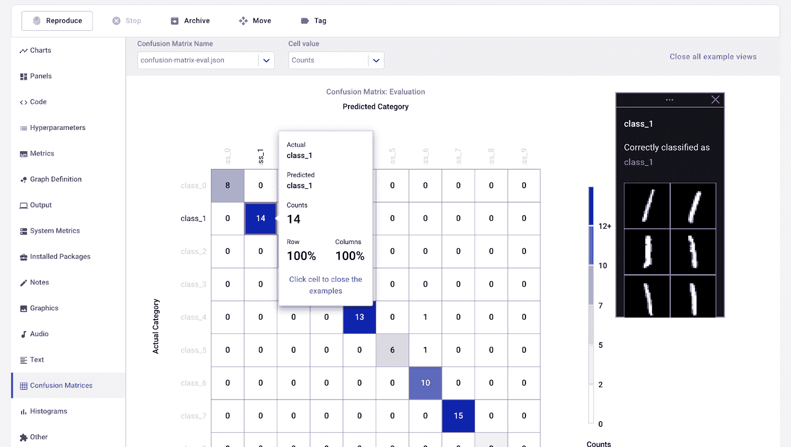

来自彗星 ML 的图像

### 3.权重和偏差

[权重&偏差](https://web.archive.org/web/20221203015923/https://wandb.ai/site)是一个 ML 平台，用于实验跟踪、数据和模型版本化、超参数优化和模型管理。此外，您可以使用它来记录工件(数据集、模型、依赖项、管道和结果)并可视化数据集(音频、视觉、文本和表格)。

Weights & Biases 有一个用户友好的中央仪表盘，用于机器学习实验。和 Comet ML 一样，可以和其他机器学习库整合，比如 Fastai，Keras，PyTorch，Hugging face，Yolov5，Spacy 等等。

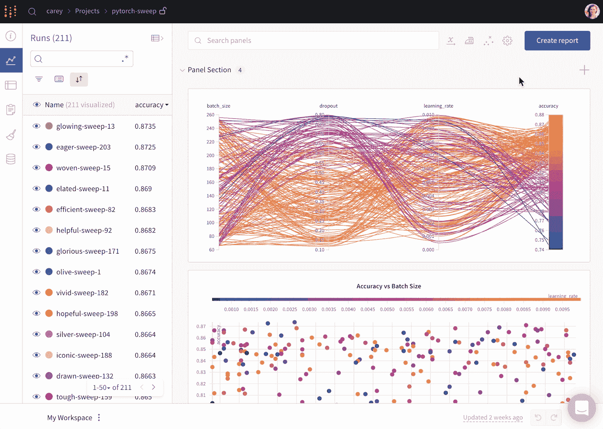

来自重量和偏差的 Gif

**注**:您也可以使用 TensorBoard、Pachyderm、DagsHub 和 DVC 工作室进行实验跟踪和 ML 元数据管理。

## 流程编排和工作流管道 MLOps 工具

这些工具可帮助您创建数据科学项目和管理机器学习工作流:

### 4.长官

[perfect](https://web.archive.org/web/20221203015923/https://www.prefect.io/)是一个现代化的数据堆栈，用于监控、协调和编排应用程序之间的工作流。它是一个开源的轻量级工具，为端到端的机器学习管道而构建。

您可以使用 Prefect Orion UI 或 Prefect Cloud 作为数据库。

Prefect Orion UI 是一个开源的、本地托管的编排引擎和 API 服务器。它让您深入了解本地 Prefect Orion 实例和工作流。

Prefect Cloud 是一个托管服务，用于可视化流程、流程运行和部署。此外，您可以管理帐户、工作区和团队协作。

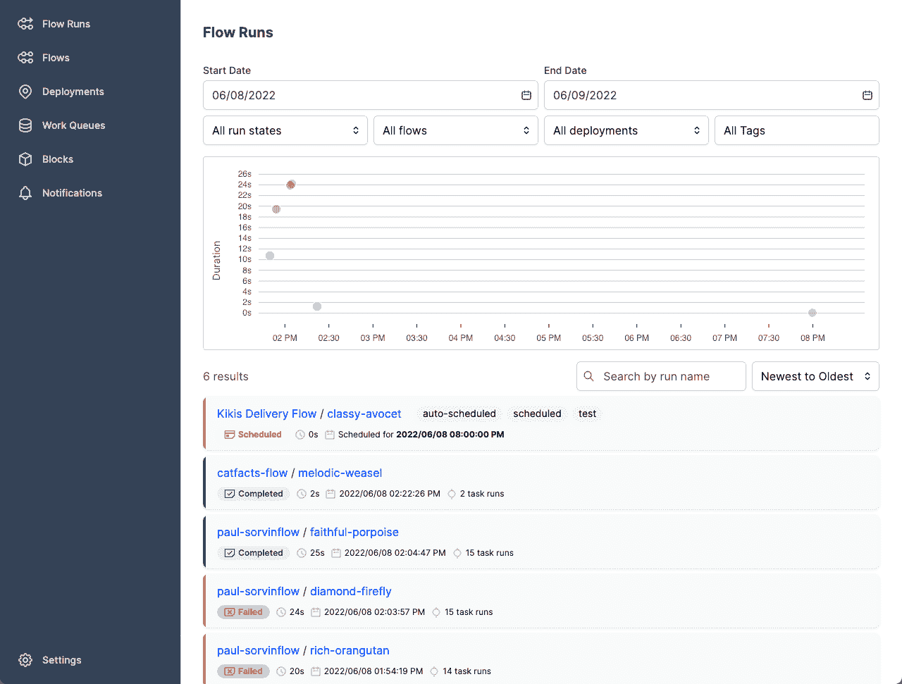

完美的形象

### 5.元流

[Metaflow](https://web.archive.org/web/20221203015923/https://metaflow.org/) 是一个强大的、久经沙场的工作流管理工具，用于数据科学和机器学习项目。它是为数据科学家而构建的，因此他们可以专注于构建模型，而不是担心 MLOps 工程。

使用 Metaflow，您可以设计工作流程，在秤台上运行工作流程，并在生产中部署模型。它自动跟踪和版本化机器学习实验和数据。此外，您可以在笔记本中可视化结果。

Metaflow 可以与多种云(包括 AWS、GCP 和 Azure)和各种机器学习 Python 包(如 Scikit-learn 和 Tensorflow)一起工作，API 也可用于 R 语言。

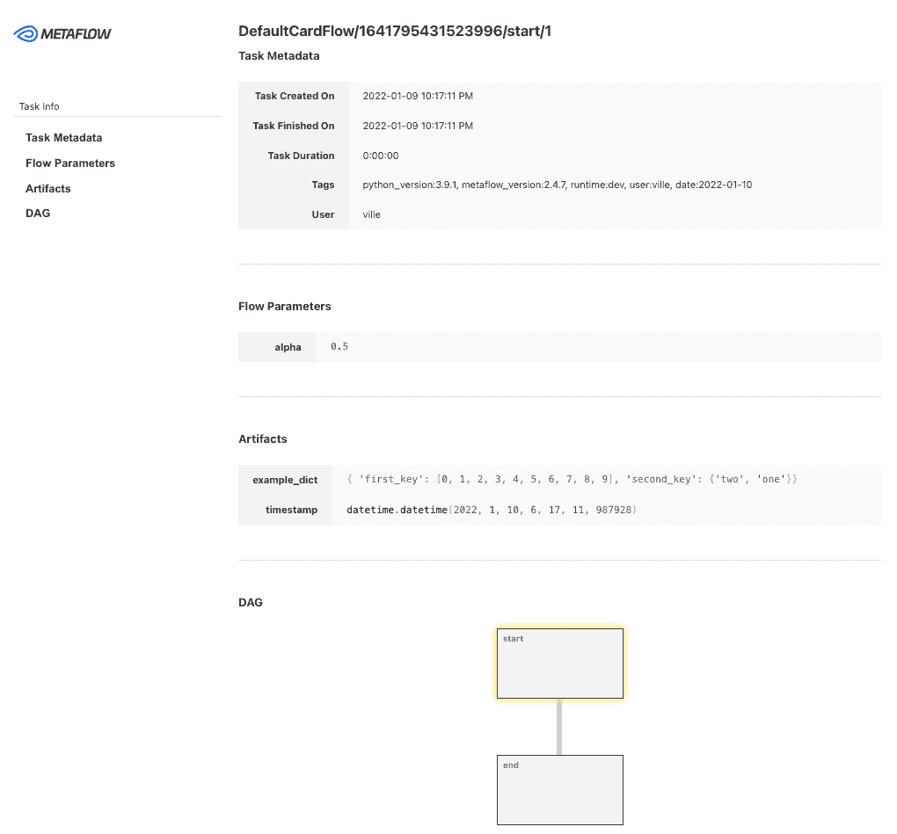

图元流中的图像

### 6\. Kedro

Kedro 是一个基于 Python 的工作流编排工具。您可以使用它来创建可再现的、可维护的和模块化的数据科学项目。它将软件工程的概念整合到机器学习中，如模块化、关注点分离和版本控制。

使用 Kedro，您可以:

1.  设置依赖关系和配置。
2.  设置数据。
3.  创建、可视化和运行管道。
4.  记录和实验跟踪。
5.  单台或分布式计算机上的部署。
6.  创建可维护的数据科学代码。
7.  创建模块化、可重用的代码。
8.  在项目上与队友协作。

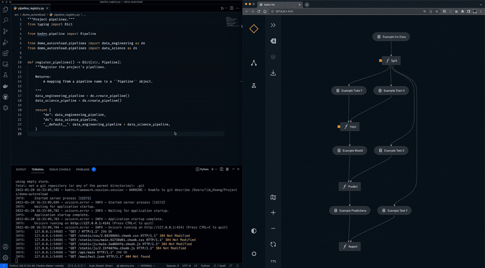

来自 Kedro 的 Gif

**注意**:您也可以使用 Kubeflow 和 DVC 进行流程编排和工作流管道。

## 数据和管道版本控制工具

借助这些 MLOps 工具，您可以管理与数据和管道版本相关的任务:

### 7.迟钝的人

[Pachyderm](https://web.archive.org/web/20221203015923/https://www.pachyderm.com/) 通过 Kubernetes 上的数据版本、血统和端到端管道实现数据转换自动化。您可以与任何数据(图像、日志、视频、CSV)、任何语言(Python、R、SQL、C/C++)以及任何规模(数 Pb 的数据、数千个作业)集成。

社区版是开源的，面向一个小团队。需要高级功能的组织和团队可以选择企业版。

就像 Git 一样，您可以使用类似的语法对数据进行版本控制。在 Pachyderm 中，对象的最高级别是 Repository，您可以使用提交、分支、文件、历史和出处来跟踪和版本化数据集。


图片来自厚皮动物

### 8.数据版本控制(DVC)

[数据版本控制](https://web.archive.org/web/20221203015923/https://dvc.org/)是一个开源的、流行的机器学习项目工具。它与 Git 无缝协作，为您提供代码、数据、模型、元数据和管道版本。

DVC 不仅仅是一个数据跟踪和版本控制工具。

您可以将它用于:

*   实验跟踪(模型度量、参数、版本)。
*   创建、可视化和运行机器学习管道。
*   部署和协作的工作流程。
*   再现性。
*   数据和模型注册。
*   使用 [CML](https://web.archive.org/web/20221203015923/https://cml.dev/) 进行机器学习的持续集成和部署。

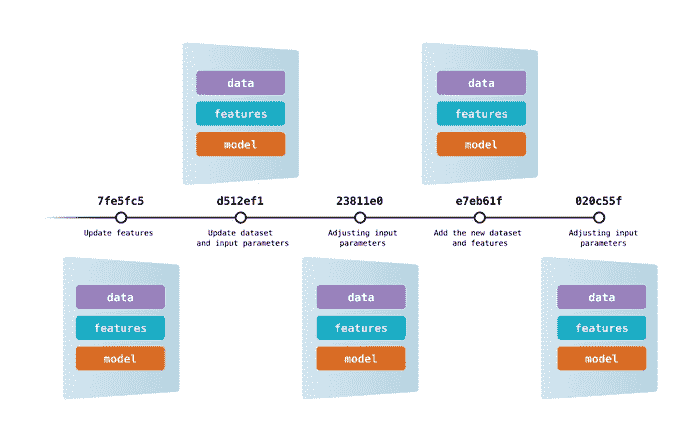

图片来自 DVC

**注意** : DagsHub 也可以用于数据和管道版本控制。

## 模型部署和服务工具

在部署模型时，这些 MLOps 工具非常有用:

### 9.TensorFlow 扩展(TFX)服务

[TensorFlow Extended (TFX)服务](https://web.archive.org/web/20221203015923/https://www.tensorflow.org/tfx/guide/serving)帮助您将经过训练的模型部署为端点。有了 TFX，你现在可以实验、训练、部署和维护机器学习模型。它允许您使用 TFX CLI 创建 REST API。

TensorFlow 服务是健壮的、灵活的和可伸缩的，它带有一个负载平衡器来管理大量的请求。您可以使用 Docker 和 Kubernetes 提供预测服务，或者使用独特的配置构建模型服务器。

TensorFlow 服务通过发起批量请求来保持硬件效率。此外，它提供了模型版本化和管理。缺点是，它只适用于 Tensorflow 模型。

```
import tempfile

MODEL_DIR = tempfile.gettempdir()
version = 1
export_path = os.path.join(MODEL_DIR, str(version))
print('export_path = {}\n'.format(export_path))

tf.keras.models.save_model(
    model,
    export_path,
    overwrite=True,
    include_optimizer=True,
    save_format=None,
    signatures=None,
    options=None
)

os.environ["MODEL_DIR"] = MODEL_DIR
```

```
nohup tensorflow_model_server \
  --rest_api_port=8501 \
  --model_name=fashion_model \
  --model_base_path="${MODEL_DIR}" >server.log 2>&1
```

### 10.BentoML

[BentoML](https://web.archive.org/web/20221203015923/https://www.bentoml.com/) 让机器学习应用的发布变得更加简单快捷。它是 Python 首创的工具，用于在生产中部署和维护 API。它通过运行并行推理和自适应批处理进行强大的优化，并提供硬件加速。

BentoML 的交互式集中式仪表板使部署机器学习模型时易于组织和监控。最棒的是，它可以与各种机器学习框架配合使用，如 Keras、ONNX、LightGBM、Pytorch 和 Scikit-learn。简而言之，BentoML 为模型部署、服务和监控提供了完整的解决方案。

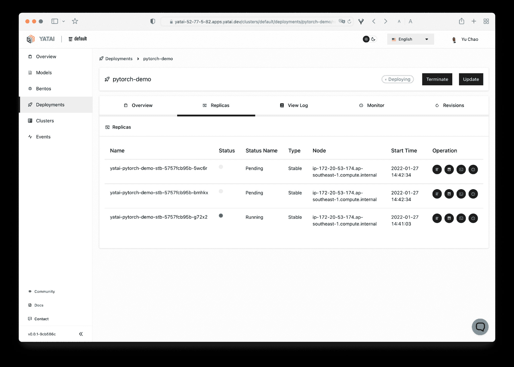

图片来自 BentoML

### 11.皮质

[Cortex](https://web.archive.org/web/20221203015923/https://www.cortex.dev/) 让你在生产中部署、管理和扩展机器学习模型。它是一个开源、灵活、多框架的模型服务和监控工具。

Cortex 扩展到 Docker、Kubernetes、TensorFlow Serving、TorchServe 和其他 ML 库。它通过提供可扩展的端点来管理负载。此外，您可以在单个 API 端点上部署多个模型，并且它支持用于保护 API 的自动伸缩特性。这是一个 MLOps 工具，允许您完全控制模型管理操作。

```
create or update apis

Usage:
  cortex deploy [CONFIG_FILE] [flags]

Flags:
  -e, --env string      environment to use
  -f, --force           override the in-progress api update
  -y, --yes             skip prompts
  -o, --output string   output format: one of pretty|json (default "pretty")
  -h, --help            help for deploy
```

**注意**:您还可以使用 MLflow、Kubeflow 和 AWS sagemaker 进行模型部署和服务。

## 生产 ML Ops 工具中的模型监控

无论您的 ML 模型是处于开发、验证还是部署到生产中，这些工具都可以帮助您监控一系列因素:

### 12.明显地

显然，AI 是一个开源的 Python 库，用于在开发、验证和生产过程中监控 ML 模型。它检查数据和模型质量、数据漂移、目标漂移以及回归和分类性能。

显然有三个主要组成部分:

1.  **测试**(批量模型检查):用于执行结构化数据和模型质量检查。
2.  **报告**(交互式仪表盘):交互式数据漂移、模型性能和目标虚拟化。
3.  **监视器**(实时监视):监视来自已部署的 ML 服务的数据和模型度量。

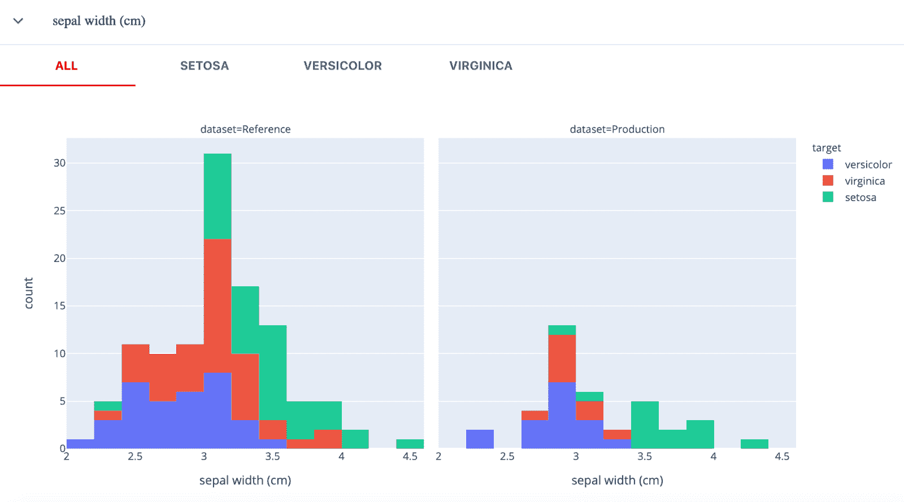

图片显然来自

### 13.游手好闲的人

Fiddler AI 是一个 ML 模型监控工具，有一个简单易用，清晰的用户界面。它允许您解释和调试预测，分析整个数据集的模式行为，大规模部署机器学习模型，以及监控模型性能。

让我们看看 ML 监控的主要 Fiddler AI 特性:

*   **性能监控**:对数据漂移、漂移时间以及漂移方式的深度可视化。
*   **数据完整性**:避免为模型训练输入不正确的数据。
*   **跟踪异常值**:显示单变量和多变量异常值。
*   **服务指标**:显示对 ML 服务操作的基本洞察。
*   **预警**:为一个模型或一组模型设置预警，对生产中出现的问题进行预警。


图片来自 Fiddler

### 14.Censius AI

Censius 是一个端到端的人工智能可观察性平台，提供自动监控和主动故障排除。它允许您监控整个 ML 管道，解释预测，并修复问题。您可以使用 Python 或 Java SDK 或 REST API 设置 Censius，并将其部署在本地或云上。

**主要特点**:

*   监控性能下降、数据漂移和数据质量。
*   实时通知，提醒未来的问题。
*   用于数据、模型和业务指标的可定制仪表板。
*   对 A/B 测试框架的本机支持。
*   表格、图像和文本数据集的数据解释能力。

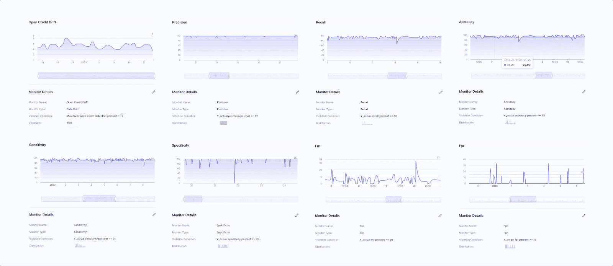

图片来自人口普查

**注**:亚马逊 Sagemaker 还提供生产中的模型监控。

此外，请阅读[机器学习、管道、部署和 MLOps 教程](https://web.archive.org/web/20221203015923/https://www.datacamp.com/tutorial/tutorial-machine-learning-pipelines-mlops-deployment)，通过代码示例了解如何将多个 MLOps 工具集成到机器学习应用中。

## 端到端 MLOps 平台

如果您正在寻找一个可以在整个过程中提供帮助的综合 MLOps 工具，以下是一些最佳工具:

### 15.AWS SageMaker

[Amazon Web Services sage maker](https://web.archive.org/web/20221203015923/https://aws.amazon.com/sagemaker/mlops/?sagemaker-data-wrangler-whats-new.sort-by=item.additionalFields.postDateTime&sagemaker-data-wrangler-whats-new.sort-order=desc)是 MLOps 的一站式解决方案。您可以培训和加速模型开发、跟踪和版本化实验、编目 ML 工件、集成 CI/CD ML 管道，以及无缝地部署、服务和监控生产中的模型。

**主要特点**:

*   数据科学团队的协作环境。
*   自动化 ML 培训工作流程。
*   在生产中部署和管理模型。
*   跟踪和维护模型版本。
*   用于自动集成和部署的 CI/CD。
*   持续监控和保留模型以保持质量。
*   优化成本和性能。


图片来自亚马逊 pagemaker

### 16.达格舒卜

DagsHub 是一个为机器学习社区制作的平台，用于跟踪和版本化数据、模型、实验、ML 管道和代码。它允许您的团队构建、审查和共享机器学习项目。

简单来说就是一个机器学习的 GitHub，你得到各种工具来优化端到端的机器学习过程。

**主要特点**:

*   您的 ML 项目的 Git 和 DVC 库。
*   DagsHub 记录器和 MLflow 实例用于实验跟踪。
*   使用 label studio 实例的数据集注记。
*   区分 Jupyter 笔记本、代码、数据集和图像。
*   能够对文件、代码行或数据集进行注释。
*   像 GitHub wiki 一样为项目创建一个报告。
*   ML 管道可视化。
*   可重复的结果。
*   运行 CI/CD 进行模型培训和部署。
*   数据合并。
*   提供与 GitHub、Google Colab、DVC、Jenkins、外部存储、webhooks 和 New Relic 的集成。

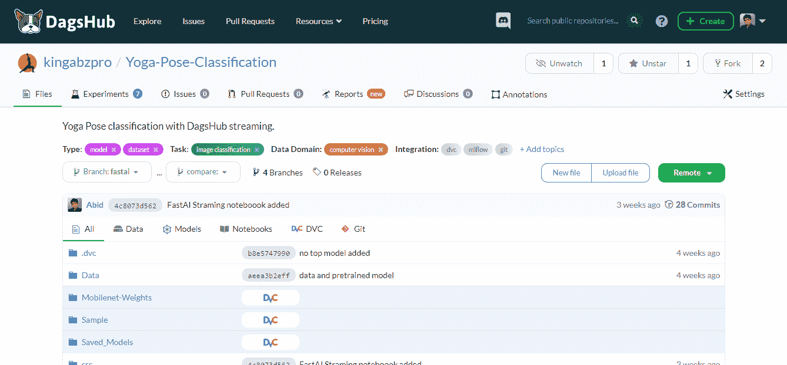

作者图片

### 17\. Kubeflow

[Kubeflow](https://web.archive.org/web/20221203015923/https://www.kubeflow.org/docs/) 让机器学习模型在 Kubernetes 上的部署变得简单、可移植、可扩展。您可以使用它进行数据准备、模型训练、模型优化、预测服务，并在生产中调整模型性能。您可以在本地、内部或云中部署机器学习工作流。简而言之，它让数据科学团队更容易使用 Kubernetes。

**主要特点**:

*   具有交互式用户界面的集中式仪表板。
*   用于再现性和流线化的机器学习管道。
*   为 JupyterLab、RStudio 和 Visual Studio 代码提供本机支持。
*   超参数调整和神经结构搜索。
*   Tensorflow、Pytorch、PaddlePaddle、MXNet、XGboost 的培训工作。
*   作业调度。
*   为管理员提供多用户隔离。
*   与所有主要的云提供商合作。

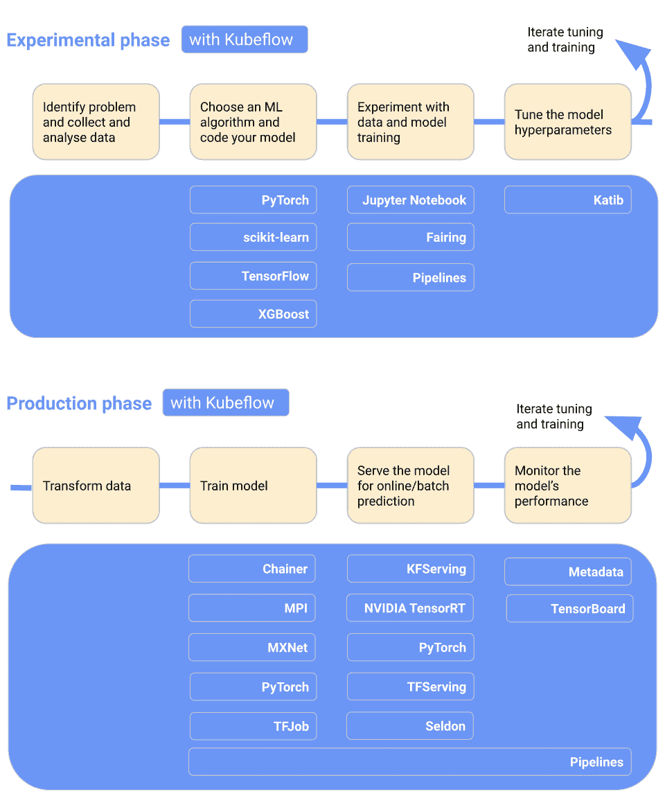

图片来自 Kubeflow

## 结论

我们正处于 MLOps 行业蓬勃发展的时期。每周您都会看到新的开发、新的创业公司和新的工具推出，以解决将笔记本电脑转换为生产就绪型应用程序的基本问题。甚至现有的工具也在扩展视野，集成新功能，成为超级 MLOps 工具。

在这篇博客中，我们了解了适用于 MLOps 流程各个步骤的最佳 MLOps 工具。这些工具将在实验、开发、部署和监控阶段为您提供帮助。

如果你是机器学习的新手，想要掌握作为机器学习科学家的基本技能，请尝试参加我们的[机器学习科学家与 Python](https://web.archive.org/web/20221203015923/https://www.datacamp.com/tracks/machine-learning-scientist-with-python) 职业跟踪。

如果您是专业人士，并且想要了解更多关于标准 MLOps 实践的信息，请阅读我们关于 [MLOps 最佳实践以及如何应用它们的文章](https://web.archive.org/web/20221203015923/https://www.datacamp.com/blog/mlops-best-practices-and-how-to-apply-them)。

MLOps 工具有助于标准化、简化和优化 ML 生态系统。这些工具用于实验跟踪、模型元数据管理、编排、模型优化、工作流版本控制、模型部署和服务以及生产中的模型监控。

*   实施云解决方案的能力。
*   使用 Docker 和 Kubernetes 的经验。
*   使用实验跟踪和工作流程版本控制进行质量保证的经验。
*   构建 MLOps 管道的能力。
*   熟悉 Linux 操作系统。
*   具有使用 PyTorch、Tensorflow 和 TFX 等 ML 框架的经验。
*   拥有 DevOps 和软件开发经验。
*   具有单元和集成测试、数据和模型验证以及部署后监控的经验。

AWS、GCP 和 Azure 为机器学习生命周期提供了各种工具。它们都为 MLOps 提供端到端的解决方案。AWS 在知名度和市场份额方面领先。它还为模型训练、服务和监控提供了简单的解决方案。

这取决于你以前的经验。要掌握 MLOps，你需要同时学习机器学习和软件开发生命周期。除了精通编程语言之外，您还需要学习几个 MLOps 工具。DevOps 工程师学习 MLOps 很容易，因为大多数工具和策略都是由软件开发驱动的。

这取决于使用案例。Kubeflow 提供了比 MLflow 更高层次的可再现性，因为它管理编排。

*   Kubeflow 一般用于大规模部署和管理复杂的 ML 系统。
*   **MLFlow** 一般用于 ML 实验跟踪，存储和管理模型元数据。

两者都是软件开发策略。DevOps 专注于开发和管理大规模软件系统，而 MLOps 专注于在生产中部署和维护机器学习模型。

*   **DevOps:** 持续集成(CI)和持续交付(CD)。
*   **MLOps:** 持续集成，持续交付，持续培训，持续监控。