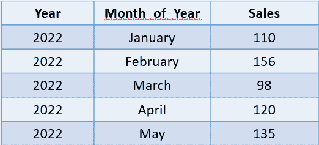
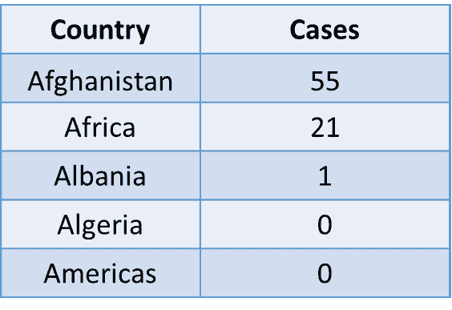

# SQL 是用来做什么的？7 大 SQL 用法

> 原文：<https://web.archive.org/web/20221212135909/https://www.datacamp.com/blog/what-is-sql-used-for>

## 数据库介绍

数据库是以电子方式存储和访问的结构化信息的集合。它们使得公司提取、更新和分析内部数据变得容易，通常是通过使用 SQL 或类似的语言。

公司使用数据库主要是因为电子表格和文件不可伸缩。虽然它们可能适合不收集大量数据的小公司和初创公司，但它们只能存储有限的信息。

例如，一个 Excel 文件只能存储大约 100 万行数据，当用户试图对其执行复杂操作时，即使这样也会大大降低系统性能。相比之下，数据库可以在不到一分钟的时间内加载超过 1000 万行数据。

此外，数据库允许简单的数据操作、分析和聚集，这是电子表格或文本文件所不能做到的。

组织使用许多不同类型的数据库来存储内部数据，最流行的是关系数据库。

关系数据库存储数据点，数据点之间有预定义的关系，可以使用一种称为 SQL 的语言来访问。要全面了解关系数据库及其工作原理，请查看我们的课程。

## 什么是 SQL？

SQL(结构化查询语言)是一种用于在关系数据库中存储、检索和操作数据的标准语言。

它允许最终用户与数据库通信，并执行创建、更新和删除数据库等任务。几乎每个大中型组织都使用 SQL，包括脸书、微软、LinkedIn 和埃森哲。

事实上，SQL 在 2021 年被 StackOverflow 排名为最常用的数据库环境和第三受欢迎的编程语言。

## SQL 是用来做什么的？

SQL 有许多用途，用于市场营销、医疗保健和金融领域的数据和业务分析、开发和数据科学。在这一节中，我们将进一步了解 SQL 的用途，以及需要员工掌握这种语言的工作类型。

### 使用 SQL 的行业

下面，我们挑选了一些使用 SQL 来实现一系列不同结果的主要领域。

#### 1.SQL 在市场营销中的应用

营销团队通常会锁定客户，并根据组织收集的用户数据发布促销活动。

这些数据通常存储在大型数据库中，在营销人员使用之前必须进行查询。

以下是 SQL 在营销领域的应用示例:

安妮是一家电子商务公司的营销主管。每次用户与该公司的网站互动时，他们的数据都会被收集并自动存储在一个关系数据库中。数据库中存储了超过 150 万条用户数据记录。

收集的变量包括客户购买的商品、他们的性别、购买时间和唯一的用户 ID。

下面是她需要查询的数据库表的汇总视图:


从上表中，Anne 需要提取在 2021 年 8 月 25 日的大减价中购物的客户的所有详细信息。她想在下一季度开展的类似营销活动中重新锁定这些用户。

下面是一个简单的 SQL 查询，她可以在不到一分钟的时间内编写该查询来访问她需要的数据:

```
SELECT * FROM customer_data A WHERE CAST (A.Date AS Date) >= '2021-08-25';
```

该查询将从上面显示的表中返回以下结果:


上面的例子展示了 SQL 在提取相关信息[分析业务数据](https://web.archive.org/web/20221211141951/https://www.datacamp.com/courses/analyzing-business-data-in-sql)中的作用。

由于营销过程越来越多地由数据驱动，因此营销人员学习基本的 SQL 是一个好主意，这样他们就可以在开展营销活动和锁定用户时做出明智的决策。

#### 2.SQL 在金融中的应用

组织通常将财务数据存储在数据库中，因为它们高度安全且易于查询。财务专业人员可以提取这些数据来做出数据驱动的决策。

下面是一个财务团队如何使用 SQL 从数据库中查询相关信息的示例:

John 是一名财务专家，他分析季度销售数据以制定下一年的预测。他还需要确定销售额特别低的时期，以防止这种情况再次发生。

下面是 John 需要使用的名为“sales_data”的示例表:



这是一个简单的 SQL 查询，他可以编写这个查询来确定销售额低于平均水平的月份:

```
SELECT Month_of_Year, Sales FROM sales_data
WHERE Sales < (SELECT AVG(Sales) FROM sales_data);
```

他可以使用该查询的结果来确定销售模式，并使用它来创建来年的财务计划。

除了上面显示的用例之外，财务团队还可以使用 SQL 来确定收入和销售随时间变化的趋势。该语言可用于为决策者提供财务 KPI 的清晰视图，如公司的净收入和成本。

#### 3.SQL 在医疗保健中的应用

SQL 通常用于操作和分析存储在临床数据库中的患者信息。例如，它可以用于构建用户健康数据仪表板，根据医疗专业人员的输入生成患者报告，甚至创建针对大型数据库(如新冠肺炎跟踪系统)的搜索。

下面是一个在医疗保健领域如何使用 SQL 的示例:

一个非营利慈善组织收集与一种在农村地区流行的致命疾病相关的数据。志愿者随后会前往感染人数最多的高风险地区注射疫苗，以遏制疾病的传播。

下面是该组织创建的五行示例数据库:



这是一个 SQL 查询，可以用来确定感染人数最多的前 10 个地区:

```
SELECT * from diseases
ORDER BY Cases DESC
LIMIT 10
```

虽然上面的查询很有用，但对于志愿者来说，每天运行它来查找高风险区域是低效的。相反，SQL 数据库可以连接到一个实时的仪表盘，直观显示不同地区的感染人数。

下面是一个新冠肺炎仪表板示例:


[来源](https://web.archive.org/web/20221211141951/https://ourworldindata.org/polio)

上面的用例向我们展示了 SQL 在许多领域都有应用。几乎每个行业都使用它来分析数据和推动业务增长。

因此，对于非技术专业人员来说，学习基本的 SQL 是值得的，这样他们就可以与数据库进行交互，并收集必要的信息来进行日常决策。

### 使用 SQL 的作业

现在我们知道了 SQL 在各种行业中的用途，让我们来看看一些利用它的能力的具体工作。

#### 1.用于移动和 Web 开发的 SQL

开发人员在构建移动和 web 应用程序时使用 SQL。当您安装移动应用程序并创建用户名和密码时，这些信息会立即被转化为攻击者无法破译的代码，并使用 SQL 安全地存储在数据库中。

同样，当您与应用程序交互、订阅时事通讯或在线购物时，您的数据会被收集并存储在数据库中。

后端移动和应用程序开发人员需要熟练使用 SQL 来执行数据处理任务，并创建愉快的用户体验。

#### 2.用于数据分析的 SQL

数据分析师是熟练的专业人员，他们识别数据的趋势，以帮助公司的决策过程。他们使用 SQL 进行数据提取和分析，以生成可操作的见解。

管理者和利益相关者使用数据分析师揭示的模式来做出决策，从而为组织增加商业价值。

数据分析师是世界上最受欢迎的专业人士之一。参加 SQL 职业道路中的[数据分析师，立即开始向该领域过渡。](https://web.archive.org/web/20221211141951/https://www.datacamp.com/tracks/data-analyst-in-sql)

#### 3.用于业务分析的 SQL

业务分析师确定组织中需要改进的领域，并提出建议来加强业务流程。

他们可以在不同的公司领域工作，如 IT 或员工发展，并需要根据可用的数据对这些部门的变化提出建议。

这意味着业务分析师不仅需要使用 SQL 收集和分析数据，还需要创建交互式仪表板，以便向上层管理人员展示他们的发现。

SQL 可以查询与 Tableau 和 PowerBI 等可视化工具实时连接的数据库，这使它成为业务分析师使用的理想语言。

如果您想成为一名业务分析师，或者已经是一名业务分析师，并且想要提高您的 SQL 技能，请查看我们的 [SQL for Business Analysts](https://web.archive.org/web/20221211141951/https://www.datacamp.com/tracks/sql-for-business-analysts) 技能跟踪。

#### 4.用于数据科学的 SQL

数据科学家构建预测模型并分析数据，以生成可操作的见解，从而获得商业价值。这些数据几乎总是存储在关系数据库中，并且必须使用 SQL 提取。

## 为什么要学数据科学的 SQL？

当大多数人想到数据科学时，他们的脑海中往往会跳转到预测分析和机器学习建模。然而，只有当你有必要的数据时，你才能建立机器学习模型。在现实世界中，这些数据很少会像在 Kaggle 上那样以一个干净、结构化的电子表格的形式交给你。

你需要访问公司的数据库，收集你需要的数据，并对其进行预处理，然后才能开始建立预测模型。如上所述，大多数公司将数据存储在关系数据库中，这意味着您需要了解 SQL 来实现这一点。

事实上，根据最近的一项研究，SQL 是几乎 65%的数据科学工作清单中的一项要求。这意味着，即使你懂 Python，如果你缺乏 SQL 技能，你也会错过大约五分之三的工作机会。

如果你仍然不相信，下面是 [Meta 的](https://web.archive.org/web/20221211141951/https://www.metacareers.com/v2/jobs/1513749279045999/)数据科学家的工作描述，其中将 SQL 列为必备技能:


阅读我们的文章，了解如果你掌握了 SQL 语言，你能做什么。

## 如何学习数据科学的 SQL

如果您之前没有 SQL 知识，请参加我们的[SQL 简介](https://web.archive.org/web/20221211141951/https://www.datacamp.com/courses/introduction-to-sql)课程，了解该语言的基础知识。这个项目将教你数据组织，数据库中表格的结构，以及数据库构建的原则。您将学习从数据库中选择数据并执行基本的数据操作。

一旦你学会了 SQL 的基础知识，参加[中级 SQL](https://web.archive.org/web/20221211141951/https://www.datacamp.com/courses/intermediate-sql) 课程，学习使用 SQL 进行数据分析。本课程涵盖数据过滤、排序、分组和聚合函数等概念。这些操作将教会你在大量数据中发现洞见和识别趋势。

然后，参加 SQL 中的[联接数据课程，学习如何组合两个或多个数据库表。这可以说是数据科学家日常使用的最重要的 SQL 查询类型之一。](https://web.archive.org/web/20221211141951/https://www.datacamp.com/courses/joining-data-in-sql)

接下来上 SQL 中的[数据操作，学习子查询、窗口函数等更高级的 SQL 函数。](https://web.archive.org/web/20221211141951/https://www.datacamp.com/courses/data-manipulation-in-sql)

以上课程应该会让你对 SQL 有很强的掌握。在这些课程中学到的概念将帮助您准备 SQL 数据科学面试问题。

然而，要真正精通一门语言并在现实世界中使用它，你需要应用你所获得的知识。

参加[将 SQL 应用于现实世界问题](https://web.archive.org/web/20221211141951/https://www.datacamp.com/courses/applying-sql-to-real-world-problems)计划，学习使用 SQL 解决业务问题。您在参加课程时写下的问题可以包含在您的数据科学文件夹中，这将增加您在该领域获得工作的机会。

是的，SQL 是一种编程语言，因为它是图灵完全的。简而言之，如果有足够的时间和内存，图灵完备的语言应该能够解决任何计算问题。

然而，与 Java 和 Python 等编程语言不同，SQL 只能与数据库进行交互。它不能用于可视化数据、读取文件和构建 web 应用程序。因此，SQL 被称为特定领域编程语言。

阅读我们的文章，了解更多关于 SQL 是否是编程语言的信息。

数据科学面试通常评估候选人的主题，如连接、在数据库表中查找重复项、索引函数、窗口函数、分组和子查询。所有这些概念都包含在 Datacamp 的 [SQL 基础知识](https://web.archive.org/web/20221211141951/https://www.datacamp.com/tracks/sql-fundamentals)职业轨迹中。

大多数公司会给你提供一个样本数据集和一个业务问题。然后，您需要使用 SQL 函数的组合来编写一个查询，以解决手边的用例。要练习编写解决现实问题的查询，请参加 Datacamp 指导的 [SQL 项目](https://web.archive.org/web/20221211141951/https://www.datacamp.com/courses-all?tab=projects&technology=sql)。

是的，用 SQL 建立机器学习模型是可能的。 [谷歌云平台](https://web.archive.org/web/20221211141951/https://cloud.google.com/) (GCP)，一项流行的云计算服务，最近发布了一项服务，允许用户在谷歌 BigQuery 中运行 SQL 查询。

[BigQuery](https://web.archive.org/web/20221211141951/https://cloud.google.com/bigquery/docs) 是组织用来存储和管理大量数据的无服务器数据仓库。BigQuery 中的数据以结构化的关系数据库的形式存储。

[BigQuery ML](https://web.archive.org/web/20221211141951/https://cloud.google.com/bigquery-ml/docs) 允许用户使用 SQL 直接在 BigQuery 中建立机器学习模型。它支持线性回归、逻辑回归、XGBoost、K 均值聚类、ARIMA 和神经网络等算法。

要了解更多关于像 GCP 这样的云计算服务及其工作方式，请参加 Datacamp 上的 [了解云计算](https://web.archive.org/web/20221211141951/https://www.datacamp.com/courses/understanding-cloud-computing) 课程。