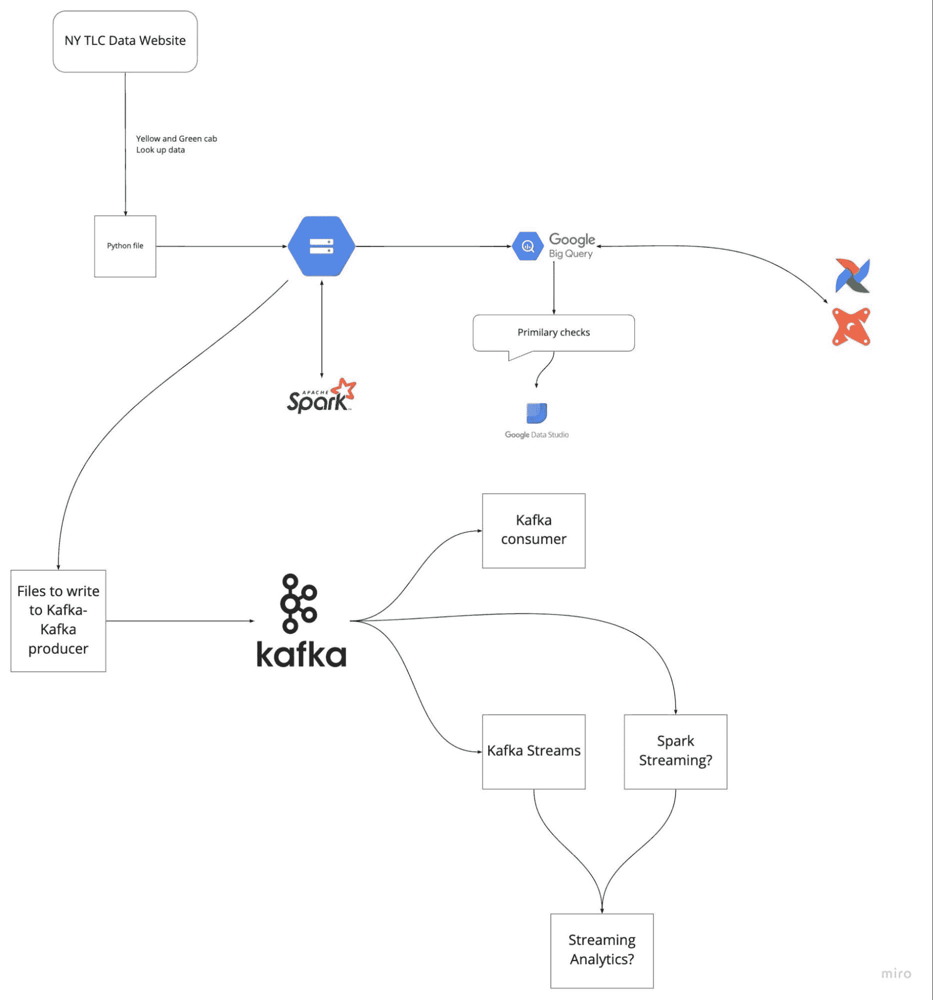

# 21 大数据工程面试问题和答案

> 原文：<https://web.archive.org/web/20221129035725/https://www.datacamp.com/blog/top-21-data-engineering-interview-questions-and-answers>


## 通用数据工程师面试问题

在一般的数据工程面试轮中，你会被 HR 经理问到你的工作经验和你给公司带来的价值。

### 什么使你成为这个职位的最佳候选人？

如果招聘经理选择你进行电话面试，他们一定在你的简介中看到了他们喜欢的东西。所以，你可以自信的面对这个问题，谈谈你的经历和职业成长。

在参加面试之前，回顾一下公司的简介和工作描述是很重要的。这样做将有助于你了解招聘经理想要什么。如果他们正在寻找一个可以设计和管理数据管道的人，确保你专门谈论它。

一般来说，你可以思考你的技能、经验和知识，以及这些因素如何让你脱颖而出。

### 据你所说，数据工程师的日常职责是什么？

这里没有绝对的答案，但是你可以分享一下你上一份工作的经历，以及你作为工程师的责任。职位描述也是寻找这些信息的好地方。

然而，一般来说，数据工程师的日常职责包括:

*   开发、测试和维护数据库
*   基于业务需求开发数据解决方案
*   数据采集
*   为 ETL、数据建模、转换和服务开发、验证和维护数据管道。
*   在某些情况下，部署统计模型。
*   通过清理、验证和监控数据流来维护数据质量。
*   提高系统可靠性、性能和质量。
*   遵循数据治理和安全指南来执行每项任务。

### 作为一名数据工程师，你觉得最难的是什么？

虽然这将取决于个人，但在数据工程师访谈中有一些共同的线索。像数据科学家和 DevOps 工程师一样，成为一名数据工程师最艰难的部分可能是学习和掌握各种技术。您需要不断集成新的工具来提高数据系统的性能、安全性、可靠性和投资回报率。

确保您了解灾难管理、数据治理、安全协议、业务需求和预测数据需求也可能很难掌握。你要负责这么多事情，这是一份艰难的工作。

### 你对哪些数据工具或框架有经验？有你喜欢的吗？

同样，这个数据工程师面试答案将基于您的经验。如果您熟悉现代工具和第三方集成，回答这个问题不会有问题。

您可以谈论用于数据库管理、数据仓库、数据编排、数据管道、云管理、数据清理、建模和转换以及批处理和实时处理的工具。

记住，这个问题没有错误答案。面试官正在评估你的技能和经验。

这些问题是为有经验的人准备的。如果你是初学者，想开始数据工程职业生涯，用 Python 职业轨迹完成[数据工程师。它由 19 门课程组成，将教授您现代数据工程概念、编程语言、工具和框架。](https://web.archive.org/web/20220818204354/https://www.datacamp.com/tracks/data-engineer-with-python)

## 数据工程师流程面试问题

经过几轮面试后，你通常会进入技术阶段，包括编码挑战、解决问题、白板上的数据库系统设计、课后考试和分析问题。

这个阶段可能会相当激烈，所以了解一些常见的数据工程面试问题和答案可以帮助你在面试中获得高分。

### 向我介绍一个你从头到尾都在做的项目。

如果您以前作为学生或专业人员从事过数据工程项目，那么这个答案应该很自然。话虽如此，提前准备总是有帮助的。

确保你解释了它是如何开始的，以及你解决了什么业务问题。此外，解释从访问原始数据到将其转换为干净的结构数据的每个步骤。

有时你正在做多个项目，你会被这个问题吓住。为了避免这种情况发生，最好回顾一下你最近参与的五个项目。你可以阅读项目文档，理解问题陈述。

看看下面的例子:



图片来自[DataTalksClub/data-engineering-zoom camp](https://web.archive.org/web/20220818204354/https://github.com/DataTalksClub/data-engineering-zoomcamp)

在上面的项目中，我们使用 Kafka 和 Spark streams 接收 [TLC 旅行记录](https://web.archive.org/web/20220818204354/https://www1.nyc.gov/site/tlc/about/tlc-trip-record-data.page)数据，并对其进行处理、转换和服务。

在项目中:

*   GCP、Terraform 和 Docker 用于云环境
*   GCP、气流和 Postgres 用于数据接收
*   数据仓库的 BigQuery 和 Airflow
*   用于分析工程的 dbt、BigQuery、Postgres、Google Studio 和元数据库
*   批量处理的火花
*   数据流的 Spark 和 Kafka

### 初级数据工程师面试问题

初级工程面试更侧重于工具、编码和 SQL 查询。它涉及关于数据库管理、ETL、编码挑战和家庭考试的问题。

当公司雇佣应届毕业生时，他们希望确保你有能力处理他们的数据和系统。

#### 你能解释一下与数据建模相关的设计模式吗？

有三种数据建模设计模式:星型、雪花型和银河型。

星型模式包含各种维度表，这些维度表连接到中心事实表。


图片来自 [guru99](https://web.archive.org/web/20220818204354/https://www.guru99.com/star-snowflake-data-warehousing.html)

雪花是星型模式的延伸。它由事实表和具有雪花状层的维度表组成。


图片来自 [guru99](https://web.archive.org/web/20220818204354/https://www.guru99.com/star-snowflake-data-warehousing.html)

Galaxy 模式包含两个事实表，并且在它们之间共享维度表。


图片来自 [guru99](https://web.archive.org/web/20220818204354/https://www.guru99.com/star-snowflake-data-warehousing.html)

#### 你用过哪些 ETL 工具？你最喜欢什么，为什么？

在这里，你应该提到你已经掌握的工具列表，并解释为什么你为某些项目选择了某些工具。

招聘经理正在评估你对各种 ETL 工具的经验和知识，所以请从利弊方面解释你选择这些工具的原因。

您还可以提到流行的开源工具，如 dbt、Spark、Kafka 和 Airbyte。你可以通过参加[数据工程介绍](https://web.archive.org/web/20220818204354/https://www.datacamp.com/courses/introduction-to-data-engineering?hl=GB)课程来更新你的 ETL 知识。

### 数据工程师经理面试问题

对于工程经理职位，问题与决策制定、业务理解、管理和维护数据集、合规性和安全策略有关。

#### 数据仓库和操作数据库有什么区别？

数据仓库为数据分析任务和决策提供历史数据。它支持高容量分析处理，如 OLAP。数据仓库旨在加载访问多行的高复杂度查询。该系统支持少量并发用户，旨在快速检索大量数据。

操作数据库管理系统用于实时管理动态数据集。它们支持数千个并发客户端的高容量事务处理。通常，这些数据包含有关业务运营的日常信息。

#### 你认为为什么每个使用数据系统的公司都需要灾难恢复计划？

灾难管理是数据工程师经理工作中最重要的部分。数据工程师经理计划并准备各种数据存储系统的灾难恢复。

该任务涉及文件和媒体的实时备份。备份存储将用于在网络攻击或设备故障的情况下恢复文件。安全协议用于监控、跟踪和限制传入和传出流量。

## 数据工程师技术面试问题

### 数据工程工具


作者图片

#### 什么是数据编排，您可以使用什么工具来执行它？

数据编排是一个自动化的过程，用于访问来自多个来源的原始数据，执行数据清理、转换和建模技术，并为分析任务提供服务。最流行的工具是 Apache Airflow、Prefect、Dagster 和 AWS Glue。

#### 你在分析工程中使用什么工具？

分析工程是一个过程，在这个过程中，我们访问经过处理的数据，对其进行转换，应用统计建模，并以报告和仪表板的形式将其可视化。流行的工具有 dbt(数据构建工具)、BigQuery、Postgres、Metabase、Google Data Studio 和 Tableau。

### 面向数据工程师的 Python 面试问题

#### 哪些 Python 库的数据处理效率最高？

最流行的数据处理库是 **pandas** 和 **Numpy** 。对于大数据集的并行处理，我们使用 **Dask** 、 **Pyspark** 、 **Datatable** 和 **Rapids** 。它们各有利弊，我们必须基于数据需求来理解应用程序。

#### 在 Python 中如何执行 web 抓取？

1.  使用**请求**库和 URL 访问网页
2.  使用 **BeautifulSoup** 提取表格和信息
3.  转换成使用**熊猫**的结构
4.  使用**熊猫**和**熊猫**来清洁它
5.  以 CSV 文件的形式保存数据

在某些情况下， **pandas.read_html** 可以创造奇迹。它以结构化格式提取、处理和转换数据。

**注意**:在像[黑客排名](https://web.archive.org/web/20220818204354/https://www.hackerrank.com/dashboard)、[代码大战](https://web.archive.org/web/20220818204354/https://www.codewars.com/)和 [LeetCode](https://web.archive.org/web/20220818204354/https://leetcode.com/) 这样的网站上接受编码挑战是一种很好的做法。您可以通过参加 [DataCamp 的 5 项 Python 挑战](https://web.archive.org/web/20220818204354/https://www.datacamp.com/blog/5-python-challenges)来磨练您的 Python 技能。

### 数据工程师的 SQL 面试问题

SQL 编码阶段是数据工程雇佣过程的一个重要部分。可以练习各种简单和复杂的脚本。面试官可能会要求你写一个关于数据分析、常用表表达式、排名、添加小计和临时函数的查询。

#### SQL 中常见的表表达式有哪些？

这些用于简化复杂的连接和运行子查询。

在下面的 SQL 脚本中，我们运行一个简单的子查询来显示所有拥有**理科**专业和 **A** 成绩的学生。

```
SELECT *
FROM class
WHERE id in
  (SELECT DISTINCT id
  FROM id
  WHERE grade= "A"
  AND major= "Science"
  )
```

如果我们多次使用这个子查询，我们可以创建一个临时表“temp ”,并在查询中使用 SELECT 命令调用它，如下所示。

```
WITH temp as (
  SELECT id as id
  FROM id
  WHERE grade= "A"
  AND major= "Science"
)

SELECT *
FROM class
WHERE id in (SELECT id from temp)
```

你可以把这个例子翻译成更复杂的问题。

#### 如何对 SQL 中的数据进行排序？

数据工程师通常根据销售和利润等参数对价值进行排名。

下面的查询根据销售额对数据进行排名。还可以使用 DENSE_RANK()，如果值相同，它不会跳过后续的等级。

```
SELECT
  id,
  sales,
  RANK() OVER (ORDER BY sales desc)
FROM bill
```

#### 能否创建一个简单的临时函数，并在 SQL 查询中使用？

就像 Python 一样，您可以在 SQL 中创建一个函数，并在查询中使用它。它看起来很优雅，你可以避免编写巨大的 case 语句- [更好的编程](https://web.archive.org/web/20220818204354/https://betterprogramming.pub/6-sql-queries-every-data-engineer-should-be-aware-of-2d0a2cc5986e)。

在下面的脚本中，我们创建了一个简单的“get_gender”临时函数。它使用**箱**将**类型**从“M/F”变为全形式“公/母”。之后，我们可以通过向 get_gender 函数提供一个列名来调用它。

```
CREATE TEMPORARY FUNCTION get_gender(type varchar) AS (
  CASE WHEN type = "M" THEN "male"
        WHEN type = "F" THEN "female"
        ELSE "n/a"
  END
)
SELECT
  name,
  get_gender(Type) as gender
FROM class
```

解决 SQL 编码练习题是练习和修改遗忘概念的最好方法。您可以通过参加 DataCamp 的评估测试[SQL](https://web.archive.org/web/20220818204354/https://assessment-v2.datacamp.com/exploratory-analysis-postgres)中的数据分析来获得您的 SQL 技能(您需要一个 DataCamp 帐户来访问此评估)。

## FAANG 数据工程师问题

在这一部分，我们探讨了脸书、亚马逊、谷歌和人力资源经理在数据工程职位面试中最常问的问题。

### 脸书数据工程师面试问题

#### 我们为什么要在卡夫卡中使用集群，它有什么好处？

Kafka 集群由多个代理组成，在多个实例上分发数据。它无需停机即可扩展。Apache Kafka 集群用于避免延迟。如果主集群宕机，其他 Kafka 集群将用于提供相同的服务。

Kafka 集群架构由主题、代理、动物园管理员、生产者和消费者组成。它处理大数据的数据流，用于创建数据驱动的应用程序。

#### 阿帕奇气流解决了什么问题？

Apache Airflow 允许您在一个屋檐下管理和调度分析工作流、数据仓库管理、数据转换和建模的管道。

您可以在一个地方监视执行日志，回调可用于向 Slack 和 Discord 发送失败警报。最后，它易于使用，提供了一个有用的用户界面和健壮的集成，并且可以免费使用。

### 亚马逊数据工程师面试问题

#### 您将获得一个 IP 地址作为字符串形式的输入。你如何发现它是否是一个有效的 IP 地址？

这是编码面试中最常见的问题，答案很简单。您将在“.”上拆分字符串并创建多个检查来确定 IP 地址的有效性。

```
def is_valid(ip):

    ip = ip.split(".")

    for i in ip:
        if (len(i) > 3 or int(i) < 0 or
                          int(i) > 255):
            return False
        if len(i) > 1 and int(i) == 0:
            return False
        if (len(i) > 1 and int(i) != 0 and
            i[0] == '0'):
            return False

    return True

A = "255.255.11.135"
B = "255.050.11.5345"
```

**A** IP 有效，它返回**真**，而 **B** 返回**假**，因为它在点之后有 4 个数字。

```
print(is_valid(A))
>>> True
print(is_valid(B))
>>> False
```

#### Hadoop 中的各种模式有哪些？

Hadoop 主要工作在 3 种模式下:

*   **独立模式**:在不使用 HDFS 的情况下用于调试。它使用本地文件系统进行输入和输出。
*   **伪分布式模式**:由单个节点集群组成，NameNode 和 Data 节点驻留在同一个地方。它主要用于测试目的。
*   **完全分布式模式**:这是一种生产就绪模式，其中多个集群正在运行。数据分布在多个节点上。它有单独的主守护进程和从守护进程节点。

### 谷歌数据工程师面试问题

#### 如何处理 SQL 查询中的重复数据点？

您可以使用 **DISTINCT** 来避免重复。

下面的查询将从 CUSTOMERS 表中返回唯一的数据点。

```
SELECT DISTINCT Name, ADDRESS FROM CUSTOMERS
ORDER BY Name;
```

或者使用带有**最大**或**最小**命令的 **rowid** 删除重复行。

SQL 查询正在删除 **rowid** ，其中 **rowid** 是一个 **MAX** ，按雇员姓名和地址分组。它会将表分组为**名称**和**地址**，并挑选最高的行 id，丢弃其他的。表中的每条记录都有一个唯一的 **rowid** ，它指向磁盘中的一个物理位置。

```
DELETE FROM Employee
WHERE rowid NOT IN (
  SELECT MAX(rowid)
  FROM Employee
 GROUP BY Name, ADDRESS
);
```

#### 给定一个 n-1 个整数的列表，这些整数在 1 到 n 的范围内。列表中没有重复项。列表中缺少一个整数。你能写一个有效的代码来找到丢失的整数吗？

这是最常见的编码面试挑战之一。面试官在寻找有推理能力的高效代码。

我们将创建 **search_missing_number** 函数，它将:

1.  检查是否有空列表并返回 1，或者如果没有缺失值，它将返回列表的长度+1
2.  如果它通过了所有检查，它将计算前 N 个自然数的和 n*(n+1)/2 -> total
3.  求所有列表元素的和->总和
4.  返回第一个自然数之和与所有元素之和的差。

```
def search_missing_number(list_num):
    n = len(list_num)
    # checks
    if(list_num[0] != 1):
        return 1
    if(list_num[n-1] != (n+1)):
        return n+1

    total = (n + 1)*(n + 2)/2
    sum_of_L = sum(list_num)
    return total - sum_of_L
```

验证:

```
num_list = [1, 2, 3, 4, 5, 6, 7, 8, 9, 10, 11, 13]
print("The missing number is", search_missing_number(num_list))

>>> The missing number is 12.0
```

## 如何准备数据工程师面试

在参加面试之前，你应该复习数据工程中使用的所有概念和标准术语。此外，你应该为技术面试做准备。

*   **掌握 SQL** :你应该练习创建、修改和管理数据库。此外，您应该掌握数据分析、建模和转换。
*   **解决编码挑战**:解决 Python、Scala 或 C++编码挑战。大多数公司通过课后考试和现场编码挑战来评估编程技能。
*   **设计 ETL 管道**:练习创建数据、ETL 或交付管道。您需要了解如何测试、验证、扩展和维护数据管道。
*   **分析工程**:练习加载、转换和数据分析。学习创建数据质量和系统性能的仪表板。
*   **复习潜在问题**:复习模拟问题样本，为面试做准备。在谷歌上简单搜索就能获得数百个问题。
*   **了解现代数据工程工具**:即使你没有使用现代数据工程工具的经验，你也应该知道它们是如何工作的，以及它们如何与其他工具集成。公司总是在寻找更好的工具，以更低的成本提高性能。
*   **学习批处理和流式** : Apache Spark 用于批处理，Apache Kafka 用于数据流。这些工具需求量很大，它们会帮助你在顶级公司找到工作。
*   **环境**:有些情况下，面试官会问云计算(GCP、AWS、Azure)、Docker、脚本、Terraform、Kubernetes。您可以使用这些工具来设置云或本地计算机和存储资源。理解这些技术并将它们集成到组合项目中是一个很好的实践。

了解[如何成为一名数据工程师](https://web.archive.org/web/20220818204354/https://www.datacamp.com/blog/how-to-become-a-data-engineer)启动你的职业生涯，并在数据科学领域最受欢迎的职业中找到一份工作。

人力资源电话筛选、技术电话筛选、课后考试、编码挑战、现场面试、白板数据库和系统设计、SQL 面试，最后是检查文化契合度的“高管”面试。

有些公司有三个阶段的面试，而有些公司有多达九个阶段。组织通常有很高的门槛来测试每个级别的候选人。

是的，每一个产生数据的公司都需要数据工程师来创建管道，管理数据，并将数据交付给各个部门。到 2025 年，我们每天将产生 463 艾字节的数据，我们将需要越来越多的工程师来提取、转换和管理数据管道和系统-[【weforum.org】](https://web.archive.org/web/20220818204354/https://www.weforum.org/agenda/2019/04/how-much-data-is-generated-each-day-cf4bddf29f/)。

是的，每一个与 IT 领域相关的人都必须学会写代码，即使是在管理层。对于数据工程师来说，Python、SQL、Docker、Yaml、Bash 是必备的编码语言。它们在基础设施中用作代码、管道、数据库管理、流、网络抓取、数据处理、建模和分析。

数据工程师为数据分析师收集、转换和准备数据，以提取有价值的业务洞察力。数据工程师管理整个数据库系统，并确保他们为数据分析任务提供高质量的数据，如分析报告、仪表板、客户研究和预测。

从多个来源获取数据，创建、验证和维护数据管道，使用算法转换数据，执行分析工程，确保符合数据治理和安全性，以及维护整个数据库系统。他们负责向公司的各个部门提供高质量的数据流。可以通过阅读 [了解更多关于数据工程的知识什么是数据工程？](https://web.archive.org/web/20220818204354/https://www.datacamp.com/blog/what-is-data-engineering) 博客。

你必须知道编码、数据仓库、ETL(提取转换负载)、SQL 查询、数据分析和建模、关键事物和沟通技巧。数据工程是通过经验和克服该领域的复杂挑战来学习的。

根据 Indeed 的数据，美国数据行业的平均工资在 116，037 美元到 299，953 美元之间。你的薪水将取决于公司的规模、地点和经验。例如，如果你在洛杉矶有 5 年以上的工作经验，并且你正在申请 Meta，那么你的基本工资将是每年 178，210 美元。欧洲的工资往往低很多，在亚洲，又更低。