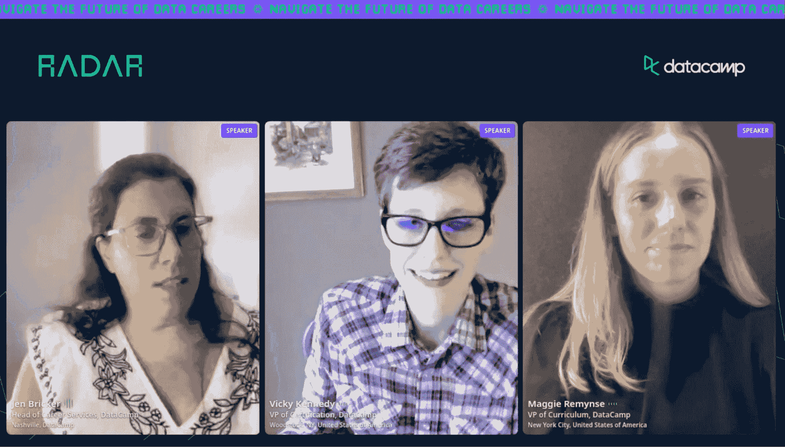

# 雷达回顾—数据科学认证:值得吗？

> 原文：<https://web.archive.org/web/20230101102851/https://www.datacamp.com/blog/radar-recap-data-science-certification-worth-it>

随着对数据科学工作需求的不断增长，认证已经成为有抱负的从业者加速求职、证明他们的技能以及在招聘过程中脱颖而出的绝佳方式。

作为 [DataCamp Radar 会议](https://web.archive.org/web/20221212140039/https://www.datacamp.com/blog/datacamp-radar-helping-you-navigate-the-future-of-data-careers-june-23rd-2022-900am-to-315pm-est)的一部分，我们与 DataCamp 职业服务主管 Jen Bricker、DataCamp 认证副总裁 Vicky Kennedy 和 DataCamp 课程副总裁 Maggie Remynse 共同主持了一场关于数据科学认证价值的专题讨论会。在整个小组中，他们概述了数据科学认证，讨论了追求认证的好处和缺点，并介绍了 DataCamp 的数据科学认证以及如何通过认证。

如果你正在考虑自己申请数据认证，请继续阅读，了解这条道路是否适合你

[点击此处查看完整课程](https://web.archive.org/web/20221212140039/https://www.datacamp.com/resources/webinars/radar-data-science-certification-is-it-worth-it)

## 数据科学认证概述

在会议中，Kennedy 将数据认证定义为“专门围绕评估过程。这是对某人知识、技能和能力水平的正式认可。”她认为这种区别很重要，因为尽管人们可以通过多种方式学习，从在职培训和体验到在线培训和 MOOCs，“认证为你所学的任何方法带来了可信度。”

Kennedy 还讨论了许多组织和开发人员提供的各种认证。课程或在线培训的结业证书与知识证书之间有着明显的区别。前者是完成课程的良好动力，而后者代表了技能水平的认证。

Remynse 随后讨论了数据认证的生命周期。她认为，如果某些特定工具没有被广泛采用或长时间不相关，它们会很快消失。其他人提供长期价值，并展示多年来有价值的知识。她讨论了有多少新的认证是“通过案例研究或真实世界的例子建立起来的”，这有助于你向自己和雇主证明“你已经为真实世界做好了准备。”

Kennedy 随后描述了人们可以获得的两种类型的数据认证:基于工具的认证，通常由工具的开发者提供；基于角色的认证，与工具或技术无关。基于工具的认证的例子包括 R 或 Python 的特定语言认证或数据可视化工具的认证。基于角色的一个例子是 DataCamp 的数据分析师或数据科学家认证，这些认证验证这些相应角色所需的典型技能。

## 追求认证的利弊

由于有多种类型的认证可用，小组成员讨论了追求数据认证的利弊。他们谈到了认证如何有助于补充以职业为重点的教育学位，并加强你告诉招聘人员的故事，尽管他们也警告观众不要从太多认证的故事中抽离。

Remynsed 讨论了教育学位(例如，学士或研究生学位)是如何非常耗时，却没有多少实际的、特定于工作的学习成果。她认为，通过认证，“你实际上是在认证与你所寻找的工作相关的技能。”这仍然是一个紧张的过程，但是花在这个过程上的时间更加集中，并且提供了更多与工作相关的实际培训。她还提到，学位不能像大多数证书那样跟上最新的内容。

Kennedy 提到，认证给你在某个领域的知识带来了可信度，不管你是如何获得这些知识的。这是他们的主要利益和价值。认证也迫使你采取措施努力掌握技能。一个证书是一个有形的，合法的奖励，类似于大学毕业后获得学士或硕士学位。

肯尼迪接着建议说，你应该把重点放在具体的证书上，以便为招聘人员讲述你的故事。Remynse 补充说，认证讲述的是你“花时间，学习一个主题，学习好，必须实践它，必须掌握它，并且能够通过获得认证来展示它。”

虽然这种用认证创造有价值的故事的想法显然是积极的，但太多的认证和太广泛的认证范围会有损于你的故事。从招聘人员布里克的角度来看，她说，当她看一份有太多证书的简历时，它会使故事变得不清楚，并降低相关的、与工作相关的证书的价值。

## DataCamp 认证流程概述

在本次会议的最后部分，Kennedy 讨论了 DataCamp 认证以及如何通过认证。她讨论了数据分析师和数据科学家认证，申请人可以期待什么，以及申请人可以期待的认证更新。你可以在这里了解更多关于 DataCamp 认证的信息[。更深入地说，这里有不同的技能和资质，不同的认证测试。](https://web.archive.org/web/20221212140039/https://www.datacamp.com/certification)

### 数据分析师认证

[数据分析师认证](https://web.archive.org/web/20221212140039/https://www.datacamp.com/certification/data-analyst)评估以下领域的技能:

*   **数据管理:**使用 SQL 和数据库工具查询、清理和聚合数据的能力。
*   **探索性分析:**分析数据并从数据中解读洞见的能力
*   **生产编码:**用 Python 或 R 和 SQL 创建高质量可读代码的能力
*   **分析基础:**分析数据的最佳实践
*   统计实验:用数据创建有意义的实验所需的统计分析技能
*   **数据交流:**与各种利益相关者交流见解的能力

### 数据科学家认证

[数据科学家认证](https://web.archive.org/web/20221212140039/https://www.datacamp.com/certification/data-scientist)评估与数据分析师认证相同的技能，但超出并测试以下技能

*   模型开发:用 Python 或 R 创建机器学习模型的能力
*   **数据科学编程:**为数据科学系统和解决方案创建高质量、可读且可投入生产的代码的能力

Vicky 指出，DataCamp 的认证旨在“正式承认个人已经达到成为数据科学家或数据分析师所需的技能水平。”

除了认证过程之外，获得认证的好处是可以访问职业服务和 DataCamp 上的专属社区，以获得额外的职业支持。

## 观看完整的会议，了解更多信息

要了解更多关于认证的价值、2022 年 DataCamp 认证的新内容以及认证路线图，请务必查看完整的[Radar on session](https://web.archive.org/web/20221212140039/https://www.datacamp.com/resources/webinars/radar-data-science-certification-is-it-worth-it)。