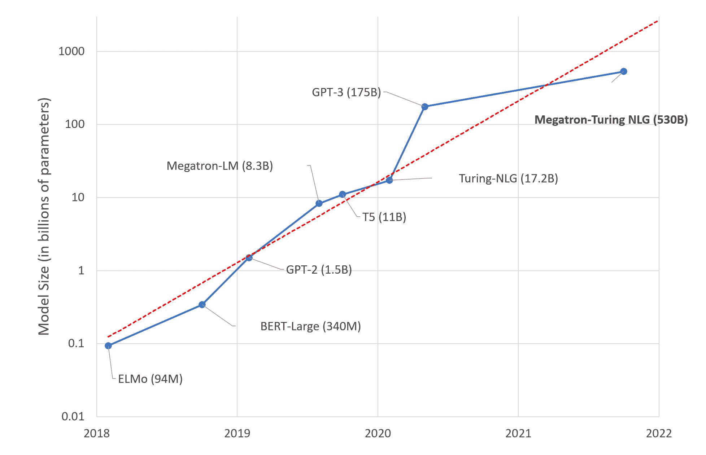
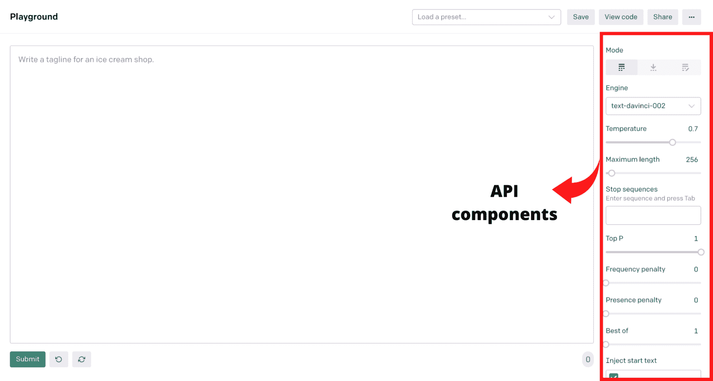
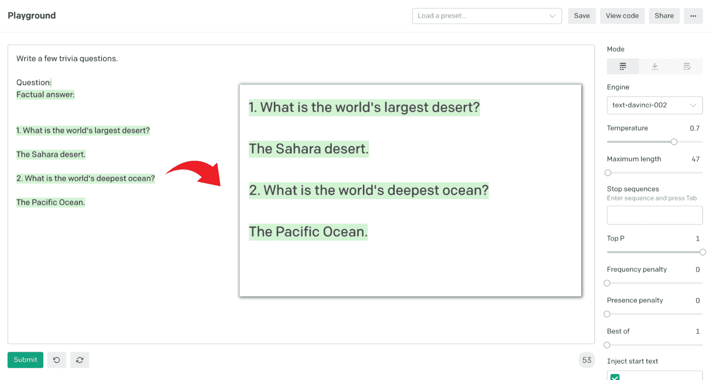

# GPT 入门指南-3

> 原文：<https://web.archive.org/web/20221129041532/https://www.datacamp.com/blog/a-beginners-guide-to-gpt-3>

自然语言处理(NLP)是语言学、计算机科学、人工智能和信息工程的一个子领域，涉及计算机和人类(自然)语言之间的交互，特别是如何对计算机进行编程以处理和分析大量自然语言数据。

听起来很有趣？如果我们告诉你，我们让一种叫做 GPT-3 的算法来写这整段文字，它第一次就写完了，你会怎么说？我们不是在开玩笑！看看这个…


*行动中的 GPT 三号*

很神奇，对吧？！那么回到 NLP。它使计算机能够以文本或语音数据的形式处理人类语言，并“理解”其全部含义，包括说话者或作者的意图和情感。在过去的十年里，NLP 作为一个领域已经成为一些最令人兴奋的人工智能发现和实现的场所。在过去的几年中，在这个领域中可以看到的最激动人心和最多产的趋势是大型语言模型，GPT-3 模型就是其中之一。

GPT-3 被一些人认为是探索人工智能的第一步。它比其他任何人工智能模型都更受关注。它在以接近人类的效率和准确性执行一系列一般性任务方面的纯粹灵活性是它如此令人兴奋的原因。它以 API 的形式发布，旨在让数据科学家、开发人员以及世界各地各行各业的人们前所未有地接触到世界上最强大的语言模型之一。

该模型由人工智能研发前沿公司 OpenAI 创建。自 2020 年 7 月首次发布以来，世界各地的开发者已经为 GPT 3 找到了数百个令人兴奋的应用，这些应用有可能提升我们沟通、学习和娱乐的方式。它能够轻松解决一般的基于语言的任务，并可以在不同的文本风格和目的之间自由移动。

在 GPT-3 之前，语言模型被设计来执行一个特定的 NLP 任务，例如文本生成、摘要或分类。GPT-3 是自然语言处理历史上第一个通用语言模型，可以在一系列 NLP 任务中表现同样出色。GPT-3 代表“生成性预训练变压器”，这是 OpenAI 的第三次迭代模型。让我们来分解这三个术语:

*   **生成式:**生成式模型是一种统计模型，用于生成新的数据点。这些模型学习数据集中变量之间的潜在关系，以便生成与数据集中的数据点相似的新数据点。
*   **预训练:**预训练模型是已经在大型数据集上训练过的模型。这使得它们可以用于很难从头开始训练模型的任务。一个预先训练好的模型可能不是 100%准确，但是它可以让你避免重新发明轮子，节省时间，提高性能。
*   **变压器:**变压器模型是 2017 年发明的著名人工神经网络。这是一个深度学习模型，旨在处理序列数据，如文本。Transformer 模型通常用于机器翻译和文本分类等任务。

在下一节中，我们将着眼于语言模型的更广泛的背景——它们是什么，它们如何工作，以及它们的用途。

## 什么是大型语言模型？

近年来，围绕构建大型语言模型(LLM ),自然语言处理(NLP)领域出现了巨大的兴趣。经过大量文本训练的 LLM 可以用于各种基于语言的任务，包括文本生成、机器翻译和问题回答。

语言建模是使用概率来理解给定语言中的句子是如何组合在一起的任务。简单的语言模型可以查看一个单词，并根据现有文本序列的统计分析，预测最有可能跟随它的下一个单词(或多个单词)。例如，句子“我喜欢走我的……”更有可能以“狗”结尾，而不是“冰箱”。用大量数据训练语言模型以使其准确预测单词序列是很重要的。

LLM 可以被认为是统计预测机器，输入文本，输出预测。您可能从手机的自动完成功能中对此很熟悉。例如，如果您键入“good”，自动完成功能可能会给出类似“morning”或“luck”的建议自动完成等自然语言处理应用程序非常依赖语言模型。

虽然语言模型已经存在很长时间了，但是直到最近它们才变得如此成功。这是由于许多因素，包括大量训练数据的可用性，更好的训练算法的开发，以及使用 GPU 来加速训练。有了更多的数据，模型可以了解更多关于单词和使用它们的上下文之间的关系。这使得模型能够更好地理解文本的含义，并生成更准确的预测。

LLM 的成功是因为它们能够捕捉文本中单词之间的依赖关系。例如，在句子“猫坐在垫子上”，单词“猫”依赖于单词“the”，单词“mat”依赖于单词“on”在大型语言模型中，这些依赖关系在模型的参数中被捕获。尽管大型语言模型已经变得更加先进，但是它们使用的参数数量已经爆炸式增长，正如您在微软研究院发布的下图中所看到的。



*最先进的自然语言处理模型的大小在对数标度上随时间变化的趋势*
*来源:微软研究博客【2021 年 10 月 11 日的帖子*

大型语言模型的预训练需要大量的计算，这是能量密集型的。对这些模型日益增长的需求需要越来越多的计算资源。这带来了巨大的环境成本，例如不可持续的能源使用和碳排放。

在 2019 年的一项研究中，麻省大学的研究人员估计，训练一个大型深度学习模型会产生 62.6 万磅导致地球变暖的二氧化碳，相当于五辆汽车一生的排放量。随着模型变得越来越大，他们的计算需求超过了硬件效率的提高。一项 2021 年的研究估计，GPT-3 的训练产生了大约 552 公吨的二氧化碳。这大约是 120 辆汽车一年的行驶量。

然而，2019 年的绿色人工智能论文指出，“公开发布预训练模型的趋势是一种绿色成功”，作者鼓励组织“继续发布他们的模型，以节省其他人重新培训他们的成本。”OpenAI 等发布预训练大型语言模型的公司正在不断研发技术，以减少训练模型的碳足迹。

GPT-3 在执行各种 NLP 任务时高度准确，这是因为它所训练的数据集规模巨大，其庞大的架构包含 1750 亿个参数，这使它能够理解这些数据中的逻辑关系。GPT-3 在来自五个大数据集的文本语料库上进行预训练，这五个大数据集包括 Common Crawl、WebText2、Books1、Books2 和 Wikipedia。这个语料库总共包括近一万亿个单词，允许 GPT-3 在零射击设置下，或者在不提供任何示例数据的情况下，成功地执行数量惊人的 NLP 任务。

在下一节中，我们将探索 transformers，这是一个著名的架构使能模型，它席卷了语言建模领域，并改变了 NLP 空间中可能的定义。

## 什么是变形金刚模型？

转换器是一种神经网络体系结构，特别适合于语言建模任务。它最早是在 2017 年的论文《[注意力是你所需要的全部](https://web.archive.org/web/20221126195342/https://arxiv.org/abs/1706.03762)》中介绍的。该论文将变压器解释为一种神经网络架构，旨在高效执行序列到序列任务，同时轻松处理[长期依赖性](https://web.archive.org/web/20221126195342/https://arxiv.org/abs/2011.04006)。Transformer 模型已经迅速成为自然语言处理任务的首选架构，目前主导着 NLP 领域。

序列到序列是一种机制，是转换器模型的主干。也称为 Seq2Seq，该体系结构将给定的元素序列(如句子中的单词)转换为另一个序列(如不同语言的句子)，这使得该体系结构特别适合翻译任务。谷歌翻译在 2016 年末开始在生产中使用[类似的架构](https://web.archive.org/web/20221126195342/https://ai.googleblog.com/2017/04/introducing-tf-seq2seq-open-source.html)。


*来源:“图解变形金刚”博客[帖子](https://web.archive.org/web/20221126195342/https://jalammar.github.io/illustrated-transformer)作者杰伊·阿拉玛*

Seq2Seq 模型由两部分组成:编码器和解码器。编码器和解码器可以被认为是只会说两种语言的人类翻译者。各有不同的母语；对于我们的例子，我们说编码器是一个母语为汉语的人，解码器是一个母语为英语的人。两者有共同的第二语言；假设是日本的。为了将中文翻译成英文，编码器将中文句子转换成日文。被称为上下文的日语句子被传递给解码器。由于解码器理解日语，并能够阅读该语言，它现在可以从日语翻译成英语。

transformer 架构的另一个关键组件是一种称为“注意”的机制。这是一种模仿认知注意力的技术。认知注意力是一种反映我们大脑如何关注句子重要部分的技术，有助于我们理解句子的整体意思。例如，当你在读这个句子时，你总是专注于你正在读的单词，但同时，你的记忆保存着这个句子最重要的关键词来提供上下文。

注意机制一段一段地查看输入序列，并在每一步决定序列的哪些其他部分是重要的。这有助于转换器过滤噪音，并通过连接本身没有任何明显的相互指向标记的相关单词来关注相关的内容。

变压器模型受益于更大的架构和更大量的数据。这使得它们比任何其他类型的神经网络都更好地理解句子中单词的上下文，这解释了它们对机器学习领域的主要影响。随着它们的不断发展，它们可能会在未来几年产生更大的影响，您可以通过几个简单的步骤开始尝试 LLM。

## GPT 入门-3

### 导航 OpenAI API

尽管 GPT-3 可以说是世界上最复杂的语言模型之一，但它的功能可以通过一个简单的“文本输入文本输出”用户界面来访问。开始使用 GPT 3 的第一件事是访问 OpenAI API。你可以在这里申请，几分钟后，你的账户就会建立起来。

一旦你获得了 OpenAI 开发者账户，我们将会看到 Playground，这是一个基于网络的私人沙盒环境，允许你试验 API 并了解其不同组件如何协同工作。



*open ai API 的组件*

以下是不同 API 组件及其功能的概述:

*   **执行引擎:**决定执行使用的语言模型。选择正确的引擎是决定您的型号性能的关键，从而获得正确的输出。
*   **响应长度:**响应长度限制了 API 在完成时包含多少文本。因为 OpenAI 按每个 API 调用生成的文本长度收费，所以响应长度对于预算有限的人来说是一个至关重要的参数。响应长度越长，成本越高。
*   **温度:** 温度控制响应的随机性，表示为 0 到 1 的范围。较低的温度值意味着 API 会用模型看到的第一样东西来响应；较高的值意味着模型在得出结果之前会评估可能符合上下文的可能响应。
*   **Top P:** Top P 控制模型应考虑完成多少随机结果，如温度刻度盘所建议的，从而确定随机性的范围。Top P 的范围是从 0 到 1。较低的值限制了创造力，而较高的值扩大了视野。
*   **频率和存在惩罚:** 频率惩罚通过“惩罚”模型来降低模型逐字重复同一行的可能性。在场惩罚增加了谈论新话题的可能性。
*   **最佳:** 此参数允许您指定要在服务器端生成的完成数(n)并返回“n”个完成中的最佳者。
*   **停止序列:** 停止序列是一组字符，指示 API 停止生成完成。
*   **注入开始&重启文本:** 注入开始文本和注入重启文本参数允许你分别在完成的开始或结束插入文本。
*   **Show Probabilities:** 该选项允许您通过显示模型可以为给定输入生成的标记的概率来调试文本提示。

OpenAI API 提供了四种不同的执行引擎，它们在使用的参数数量、性能和价格上有所不同。主要的发动机按其能力和大小由大到小依次是阿达(以阿达·洛芙莱斯命名)、巴贝奇(以查尔斯·巴贝奇命名)、居里(以玛丽·居里夫人命名)和达芬奇(以列奥纳多·达·芬奇命名)。

基于上述四个主要模型，OpenAI 推出了一系列名为 InstructGPT 的改进模型，这些模型更好地理解指令，并根据您的需求产生特定的输出。你所要做的就是告诉模型你想要它做什么，它就会尽最大努力完成你的指令。向 GPT-3 模型提供指令的过程称为快速工程。

### 快速工程

GPT 3 号被设计成任务不可知的。这意味着，给定特定的训练提示，它可能执行任意数量的任务。创造人工智能解决方案从来都不容易，但有了 GPT-3，你所需要的只是用简单的英语给出一个合理的培训提示。


*来源:[安德烈·卡帕西](https://web.archive.org/web/20221126195342/https://twitter.com/karpathy/status/1273788774422441984)2020 年 6 月 18 日发推文*

创建 GPT-3 应用程序时，首先要考虑的是培训提示的设计和内容。提示设计是启动 GPT-3 模型以给出有利的上下文响应的最重要的过程。

提示是您给模型的文本输入，以便它生成您想要的输出。设计一个好的提示就是在文本输入中给模型足够的任务上下文。GPT-3 查看输入，并尝试用它认为最好的文本来完成输入。

#### 在某种程度上，提示设计就像在玩猜字谜游戏！

写好提示的秘诀是理解 GPT 3 号对世界的了解，以及如何让模型使用这些信息产生有用的结果。在猜字谜游戏中，我们的目标是给玩家提供足够的信息，让他们利用自己的智力猜出正确的单词。同样，我们必须以训练提示的形式给 GPT-3 足够的上下文，以便模型找出模式并执行任务。我们不想因为信息过载而中断模型的自然智能流，但是给它的信息太少会导致不准确的结果。

作为一个经验法则，当设计训练提示时，你的目标应该是从模型中获得零射击响应。如果这是不可能的，那就举几个例子，而不是提供一个完整的语料库。培训提示设计的标准流程应该是这样的:

**零镜头→少量镜头→基于语料库的启动**

如果在您的文本输入中，模型看到字母“Q”和一个问题，它将尝试写一个响应，但不一定是您期望的响应。如果没有足够的上下文，它可能会假设你正在写一个问题和错误答案的列表。如果你想得到最好的答案，你需要让 GPT-3 知道提供什么样的答案。

代替要求 GPT-3 完成该输入:

```py
Q:
A:
```

我们第一次完成的是:

```py
Q:
A:

Q:
A: 
```

通过使用这样的提示(或一些变体，取决于您希望模型生成什么类型的问题)，您将大大改进您的问题输出:

```py
Write a few trivia questions.

Q:
A: 
```

在第一次尝试中我们得到了下面的完成:

```py
What is the name of the longest river in Africa?
The Nile

What are the top 5 most spoken languages in the world?
Mandarin, Spanish, English, Hindi, Arabic
```

像上面这样简单的指令足以让 GPT-3 明白，它需要给出更符合你所寻找的答案；这种情况下，几个鸡毛蒜皮的问题。你也可以用“事实答案:”这样的短语代替“A:”来改善结果。

```py
Write a few trivia questions.

Question:
Factual answer:
```

对于这个输入，我们得到了以下完成:

```py
1\. What is the world’s largest desert?

The Sahara desert.

2\. What is the world’s deepest Ocean?

The Pacific Ocean.
```



## GPT 3 沙盒-将 OpenAI API 与 Python 结合使用

在这一节中，我们将带您浏览 GPT 3 沙盒，这是一个开源工具，只需几行 Python 代码就能把您的想法变成现实。我们将向您展示如何使用它，以及如何为您的特定应用定制它。这个沙盒的目标是让你能够创建很酷的 web 应用程序，不管你的技术背景如何。

跟随这个交互式的[视频系列](https://web.archive.org/web/20221126195342/https://www.youtube.com/playlist?list=PLHdP3OXYnDmi1m3EQ76IrLoyJj3CHhC4M)一步一步地了解如何创建和部署 GPT-3 应用程序。要使用 GPT-3 沙盒，您需要以下技术支持:

*   Python 3.7+版本
*   一个 IDE，比如 VS 代码

通过在 IDE 中打开一个新的终端并使用以下命令，从这个[存储库](https://web.archive.org/web/20221126195342/https://github.com/Shubhamsaboo/kairos_gpt3)中克隆代码:

```py
git clone https://github.com/Shubhamsaboo/kairos_gpt3
```

代码中已经包含了创建和部署 web 应用程序所需的一切。您只需要调整一些文件来为您的特定用例定制沙盒。现在，创建一个 [Python 虚拟环境](https://web.archive.org/web/20221126195342/https://packaging.python.org/guides/installing-using-pip-and-virtual-environments)开始。创建虚拟环境后，您可以使用以下命令安装所需的依赖项:

```py
pip install -r requirements.txt
```

现在你可以开始定制沙盒代码了。您需要查看的第一个文件是`training_data.py`。打开该文件，用您想要使用的训练提示替换默认提示。你可以使用 GPT-3 游乐场来试验不同的训练提示(见本书第二章中的[和下面的](https://web.archive.org/web/20221126195342/https://learning.oreilly.com/library/view/gpt-3/9781098113612)[视频](https://web.archive.org/web/20221126195342/https://www.youtube.com/watch?v=YGKY9Mc24MA&list=PLHdP3OXYnDmi1m3EQ76IrLoyJj3CHhC4M&index=3)中关于定制沙箱的更多信息)。

现在您已经准备好调整 API 参数(`Maximum tokens`、`Execution Engine`、`Temperature`、`Top-p`、`Frequency Penalty`、`Stop Sequence`)。我们建议在操场上为给定的训练提示试验不同的 API 参数值，以确定哪些值最适合您的用例。一旦你得到满意的结果，你就可以改变`training_service.py`文件中的值。

就是这样！您的基于 GPT-3 的 web 应用程序现在已经准备好了。您可以使用以下命令在本地运行它:

```py
streamlit run gpt_app.py
```

您可以使用 [Streamlit sharing](https://web.archive.org/web/20221126195342/https://streamlit.io/cloud) 来部署应用程序并将其分享给更广泛的受众。跟随这个[视频](https://web.archive.org/web/20221126195342/https://www.youtube.com/watch?v=IO2ndhOoTfc&list=PLHdP3OXYnDmi1m3EQ76IrLoyJj3CHhC4M&index=4)获得部署应用程序的完整演练。

## 你能用 GPT 3 号建造什么？

在 GPT-3 发布之前，大多数人与 AI 的交互仅限于某些特定的任务，比如让 Alexa 播放你最喜欢的歌曲，或者使用谷歌翻译用不同的语言进行交谈。随着 LLM 的发展，我们正面临着一个重大的范式转变。LLM 向我们展示了通过增加模型的大小，人工智能应用程序可以执行类似于人类的创造性和复杂的任务。

通过用正确的技术激发创意企业家的想象力，GPT-3 正在推动下一波创业浪潮。OpenAI 发布 API 后不久，初创公司纷纷用它来解决问题。让我们来探索这个动态的生态系统，看看一些在创意艺术、数据分析、聊天机器人、文案和开发工具等领域使用 GPT-3 作为其产品核心的顶级初创公司。

### 1.GPT 3 的创意应用:寓言工作室

GPT 3 最令人兴奋的功能之一是讲故事。你可以给模特一个题目，让它在零镜头的设定下写一个故事。这种可能性让作家扩展他们的想象力，创作出非凡的作品。例如，由詹妮弗·唐(Jennifer Tang)执导、奇农耶雷姆·奥丁巴(Chinonyerem Odimba)和尼娜·西格尔(Nina Segal)合作开发的话剧《AI 》描述了在 GPT 3 号的帮助下，人类和计算机之间的独特合作。

寓言工作室是一家利用该模型的创造性讲故事能力的公司。他们将尼尔·盖曼和戴夫·马卡基的儿童读物《墙里的狼》改编成了获得艾美奖的虚拟现实电影体验。由于 GPT-3 生成的对话，电影主角露西可以与人进行自然对话。该公司认为，随着该模型的不断迭代，有可能开发出一种像最好的人类作家一样熟练和有创造力的人工智能讲故事者。

### 2.GPT-3 的数据分析应用:可行的

[available](https://web.archive.org/web/20221126195342/https://www.askviable.com/)是一款反馈汇总工具，可识别调查、服务台票证、实时聊天日志和客户评论中的主题、情绪和观点。然后，它会在几秒钟内提供结果摘要。例如，如果被问及“我们的顾客在结账体验中遇到了什么困难？”可行的回答可能是:“顾客对结账流程感到失望，因为加载时间太长。他们还想在结账时编辑自己的地址，并保存多种支付方式。”

正如你对客户反馈专家的期望一样，在软件生成的每个答案旁边，都有拇指向上和拇指向下的按钮。他们在再培训中使用这种反馈。人类也是这一过程的一部分:Viable 有一个注释团队，其成员负责建立训练数据集，既用于内部模型，也用于 GPT-3 微调。他们使用微调模型的当前迭代来生成输出，然后人类对其质量进行评估。如果输出没有意义或者不准确，他们就重写它。一旦他们有了满意的输出列表，他们会将该列表反馈到训练数据集的下一次迭代中。

### 3.GPT 的聊天机器人应用-3:快速聊天

Emerson AI 是该公司 Quickchat 的聊天机器人角色，以其一般的世界知识、多语言支持和进行对话的能力而闻名。艾默生人工智能用于展示 GPT-3 驱动的聊天机器人的能力，并鼓励用户与 Quickchat 合作，为他们的公司实现这样的角色。Quickchat 的产品是一个通用的对话式人工智能，可以谈论任何主题。客户可以通过添加特定于其产品的额外信息来自定义聊天机器人。Quickchat 已经出现了各种各样的应用，例如自动化客户支持和实现人工智能角色来帮助用户搜索公司内部知识库。

与典型的聊天机器人服务提供商不同，Quickchat 不构建任何对话树或僵化的场景，也不需要教会聊天机器人以给定的方式回答问题。相反，客户遵循一个简单的过程:你复制粘贴包含你希望你的人工智能使用的所有信息的文本，然后点击重新训练按钮，这需要几秒钟来吸收知识，就是这样。现在，聊天机器人已经对你的数据进行了训练，可以进行测试对话了。

### 4.GPT-3 的营销应用:Copysmith

GPT-3 最受欢迎的应用之一是即时生成创意内容。Copysmith 就是内容生成平台的一个例子。它使用 GPT-3 生成提示，然后将其转化为电子商务业务的文本。GPT-3 似乎在营销领域大放异彩，它有助于以闪电般的速度生成、合作和推出优质内容。由于这种模式，在线中小型企业可以编写更好的行动号召和产品描述，并提升其营销游戏的水平。

### 5.GPT 3 的编码应用:速记

OpenAI 社区大使 Bram Adams 创建了 [Stenograph](https://web.archive.org/web/20221126195342/https://stenography.dev/) y，这是一个使用 GPT-3 和 Codex 来自动化编写代码文档过程的程序。

速记一炮而红，成为 ProductHunt 上的头号产品。Adams 认为文档是人们联系团队中的其他人、未来的自己或者只是偶然发现 GitHub 上的开发项目的感兴趣的人的一种方式。速记的目标是使一个项目能被其他人理解。

要了解更多关于崛起的 GPT-3 生态系统的信息，请查看我们即将出版的奥赖利图书的第[章第 4 章](https://web.archive.org/web/20221126195342/https://learning.oreilly.com/library/view/gpt-3/9781098113612) (GPT-3 作为新一代创业公司的发射台)和第[章第 5 章](https://web.archive.org/web/20221126195342/https://learning.oreilly.com/library/view/gpt-3/9781098113612) (GPT-3 针对企业)。

## 结论

*   GPT-3 标志着人工智能历史上的一个重要里程碑。这也是一个更大的 LLM 趋势的一部分，它将在未来继续向前发展。提供 API 访问的革命性步骤创造了新的模型即服务业务模型。
*   GPT-3 基于通用语言的能力为构建创新产品打开了大门。它尤其擅长解决诸如文本生成、文本摘要、分类和对话等任务。
*   有许多成功的公司很大程度上或完全建立在 GPT-3 的基础上。我们最喜欢的用例是创造性的讲故事、数据分析、聊天机器人、营销文案和开发工具。

Shubham Saboo 在全球知名公司担任过从数据科学家到人工智能传播者的多重角色。他作为人工智能传播者的工作使他建立了社区，接触到更广泛的受众，以促进新兴人工智能领域的想法和思想交流。作为他学习新事物和与社区分享知识的热情的一部分，他写关于人工智能进步及其经济影响的技术博客。他是《GPT-3:使用大型语言模型构建创新的自然语言处理产品》的合著者。

<section>

Sandra 是一名作家、福音传道者、社区建设者，也是人工智能主题的积极发言人，尤其是 GPT-3、无代码和合成媒体。她运营着一个 YouTube 频道，采访生态系统的利益相关者，讨论开创性的人工智能趋势。你可以看看她的书， [GPT-3:用大型语言模型构建 NLP 产品](https://web.archive.org/web/20221126195342/https://www.amazon.com/GPT-3-Building-Innovative-Products-Language/dp/1098113624)。

</section>