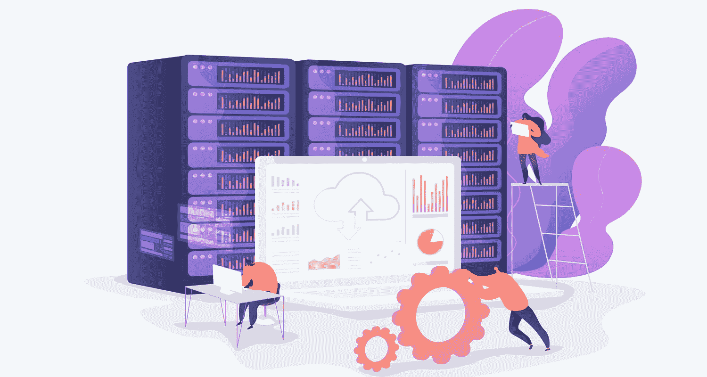
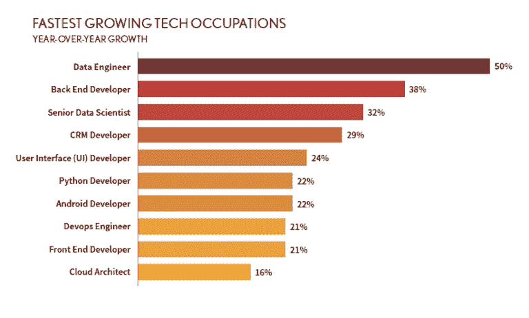

# 如何成为一名数据工程师

> 原文：<https://web.archive.org/web/20230101103026/https://www.datacamp.com/blog/how-to-become-a-data-engineer>

*   [什么是数据工程师？](#what-is-a-data-engineer?)
*   [数据工程师是做什么的？](#what-does-a-data-engineer-do?)
*   [学历要求](#educational-requirements)
*   [数据工程师需要的技能](#skills-a-data-engineer-needs)
*   [如何获得数据工程师的第一份工作](#how-to-get-your-first-job-as-a-data-engineer)
*   [数据工程面试期待什么](#what-to-expect-in-a-data-engineering-interview)
*   [期望薪资](#salary-expectations)
*   [结论](#conclusion)
*   [数据工程常见问题](#bottom)

数据工程师的角色正在数据科学生态系统中迅速占据一席之地。根据 2020 年 DICE Tech 工作报告，数据工程师是 2019 年增长最快的技术导向型职业。这份工作还出现在 [2020 LinkedIn 美国新兴工作报告](https://web.archive.org/web/20220828202820/https://business.linkedin.com/content/dam/me/business/en-us/talent-solutions/emerging-jobs-report/Emerging_Jobs_Report_U.S._FINAL.pdf)中，是过去五年中 15 个最杰出的新兴工作之一，自 2015 年以来，招聘增长率增加了 35%。

**来源:[骰子](https://web.archive.org/web/20220828202820/http://marketing.dice.com/pdf/2020/Dice_2020_Tech_Job_Report.pdf)**

你在考虑[成为一名数据工程师](https://web.archive.org/web/20220828202820/https://www.datacamp.com/data-courses/data-engineering-courses)吗？数据营是来帮助[的](https://web.archive.org/web/20220828202820/https://www.datacamp.com/courses/data-engineering-for-everyone)。在这篇博文中，我们将解释什么是数据工程师，他们在日常工作中做什么，以及为什么数据工程师是当今如此重要的选择。我们还将关注数据工程师通常具备的技能和资格。最后，我们将为您提供一些提示，帮助您获得作为数据工程师的第一份工作。

## 什么是数据工程师？

数据工程师负责为组织中数据的获取、存储、转换和管理奠定基础。他们管理数据库架构和数据处理系统的设计、创建和维护；这确保了后续的分析、可视化和机器学习模型开发工作可以无缝、连续、安全和有效地进行。简而言之，数据工程师是数据科学领域最具技术含量的职位，在软件和应用程序开发人员与传统数据科学职位之间起着至关重要的桥梁作用。

数据工程师负责传统数据科学工作流程的第一阶段:数据收集和存储的过程。它们确保从不同来源收集的大量数据成为其他数据科学专家(如数据分析师和数据科学家)可以访问的原材料。一方面，这需要开发和维护具有高可用性、高性能和集成新技术能力的可扩展数据基础设施。另一方面，数据工程师还负责监控这些系统中数据的移动和状态。

**数据科学工作流程**

## 数据工程师是做什么的？

在任何公司的数据架构的开发和维护中，数据工程师都是关键角色。他们是准备大型数据集供分析师使用的专家。当分析员需要解释信息时，数据工程师创建程序和例行程序，以合适的布局准备数据。

因此，数据工程师的日常工作基本上在两个过程之间进行:

*   ETL(提取、转换、加载)过程包括开发数据提取、转换和加载任务，以及在不同环境之间移动数据。
*   数据清理流程，以便数据以规范化和结构化的方式到达分析师和数据科学家手中。

但是数据收集和存储的过程可能极其复杂。可能涉及不同的数据源，这些数据源可能有不同类型的数据。随着手头数据的数量、种类和速度的增加，数据工程师工作的复杂性也在增加。

为了确保执行的任务是及时的、健壮的和可扩展的，数据工程师开发了所谓的数据管道。数据管道将数据移动到定义的阶段，其中一个示例是将数据从本地数据库加载到云服务。一个关键的特征是管道自动化了这种移动。不再要求数据工程师在每次创建新数据时手动运行程序，他们可以将任务安排为每小时或每天触发一次，或者在某个事件发生后触发。由于该过程是自动化的，因此需要对数据管道进行监控。幸运的是，警报可以自动生成。数据管道并不是所有的数据科学项目都需要的，但是当处理来自不同来源的大量数据时就需要了，这在数据驱动的公司中是常见的情况。如果您有兴趣了解数据管道在实践中是如何工作的，我们建议您查看我们的课程[用 Python 构建数据工程管道。](https://web.archive.org/web/20220828202820/https://www.datacamp.com/courses/building-data-engineering-pipelines-in-python?gclid=Cj0KCQjwmPSSBhCNARIsAH3cYgZMy-rCiTRhF7BTJf9mVaVEYSGZ2sulivhmIMZSBDdIZqkOPnuxJagaApztEALw_wcB#!_data?utm_source=adwords_ppc&utm_medium=cpc&utm_campaignid=16084198552&utm_adgroupid=&utm_device=c&utm_keyword=&utm_matchtype=&utm_network=x&utm_adpostion=&utm_creative=&utm_targetid=&utm_loc_interest_ms=&utm_loc_physical_ms=1005475)

## 教育要求

数据工程是一个新兴的工作。因此，只有极少数大学和学院拥有数据工程学位。数据工程师通常具有数据科学、软件工程、数学或商业相关领域的背景。根据他们的工作或行业，大多数数据工程师在获得学士学位后会获得他们的第一份入门级工作。然而，鉴于执行数据工程师的任务需要高度专业化的技能，在许多情况下，知识和能力胜过教育。

因此，如果您想接受正规教育，请确保选择一个课程中包含系统架构、编程和数据库配置的学位。

## 数据工程师需要的技能

数据工程师需要一套重要的技术技能来处理他们高度复杂的任务。然而，要在任何数据工程角色中取得成功，都很难列出一份详细而全面的技能和知识清单；最后，数据科学生态系统正在快速发展，新的技术和系统不断出现。这意味着数据工程师必须不断学习以跟上技术突破的步伐。

尽管如此，以下是任何数据工程师都应该具备的技能的非详尽列表:

*   **数据库管理:**数据工程师日常工作中相当一部分时间是在操作数据库，要么是收集、存储、传输、清理，要么只是查阅数据。因此，数据工程师必须具备良好的数据库管理知识。这需要熟练使用 SQL(结构化查询语言)，这是与数据库交互的基本语言，并精通一些最流行的 SQL 方言，包括 MySQL、SQL Server 和 PostgreSQL。除了关系数据库，数据工程师还需要熟悉 NoSQL(“不仅仅是 SQL”)数据库，它正迅速成为大数据和实时应用的首选系统。因此，尽管 NoSQL 引擎的数量在增加，但数据工程师至少应该了解 NoSQL 数据库类型之间的差异以及每种类型的用例。如果你对 NoSQL 以及它与 SQL 有何不同感到困惑，我们的课程 [NoSQL 概念](https://web.archive.org/web/20220828202820/https://www.datacamp.com/courses/nosql-concepts)是一个获得清晰的好地方。

*   **编程语言:**和其他数据科学角色一样，编码是数据工程师的必修技能。除了 SQL，数据工程师还使用其他编程语言来完成各种任务。有许多编程语言可以用于数据工程，但是 Python 无疑是最好的选择之一。Python 是数据科学中的通用语言，非常适合执行 ETL 作业和编写数据管道。使用 Python 的另一个原因是它与数据工程中至关重要的工具和框架的高度集成，如 Apache Airflow 和 Apache Spark。许多这些开源框架运行在 Java 虚拟机上。如果你的公司使用这些框架，你可能需要学习 Java 或 Scala。

*   **分布式计算框架:**近年来，分布式系统在数据科学中变得无处不在。分布式系统是一种计算环境，其中各种组件分布在网络上的多台计算机(也称为集群)上。分布式系统将工作分散到整个集群，协调工作以更有效地完成工作。分布式计算框架，如 [Apache Hadoop](https://web.archive.org/web/20220828202820/https://www.datacamp.com/community/tutorials/tutorial-cloudera-hadoop-tutorial) 和 [Apache Spark](https://web.archive.org/web/20220828202820/https://www.datacamp.com/community/tutorials/apache-spark-python) ，是为处理海量数据而设计的，它们为一些最令人印象深刻的大数据应用程序提供了基础。对于任何有抱负的数据工程师来说，拥有这些框架中某一个的专业知识是必备的。

*   **云技术:**云计算是数据科学最热门的话题之一。对基于云的解决方案的需求正在迅速改变格局。如今，作为一名数据工程师，在很大程度上需要将公司的业务系统连接到基于云的系统。随着亚马逊网络服务(AWS)、Azure 和谷歌云等服务的兴起，整个数据工作流都可以在云中进行。因此，一名优秀的数据工程师必须了解云服务的使用、优势、劣势以及在大数据项目中的应用，并具备相关经验。你至少应该熟悉 AWS 或 Azure 这样的平台，因为它们是最广泛的。

*   **ETL 框架:**数据工程师的主要角色之一是用 ETL 技术和编排框架创建数据管道。在这一部分，我们可以列出许多技术，但数据工程师应该知道或熟悉一些最著名的技术，如 [Apache Airflow](https://web.archive.org/web/20220828202820/https://www.datacamp.com/courses/introduction-to-airflow-in-python?utm_source=adwords_ppc&utm_medium=cpc&utm_campaignid=16084198552&utm_adgroupid=&utm_device=c&utm_keyword=&utm_matchtype=&utm_network=x&utm_adpostion=&utm_creative=&utm_targetid=&utm_loc_interest_ms=&utm_loc_physical_ms=1005475&gclid=CjwKCAjwu_mSBhAYEiwA5BBmf0oCCAL9gM3SMyRTp3af_YEsxy6v7GpXHoKTFApfTJOA5iD7ip1-WhoCPHoQAvD_BwE) 和 Apache NiFi。气流是一个编排框架。这是一个用于规划、生成和跟踪数据管道的开源工具。NiFi 非常适合基本的、可重复的大数据 ETL 过程。

*   **流处理框架:**一些最具创新性的数据科学应用使用实时数据。因此，对熟悉流处理框架的候选人的需求正在上升。这就是为什么，对于愿意让职业生涯更上一层楼的数据工程师来说，学习如何使用 Flink、Kafka Streams 或 Spark Streaming 等流处理工具是一个顺利的举措。

*   **Shell:** 云以及其他大数据工具和框架的大部分工作和例程都是使用 Shell 命令和脚本来执行的。数据工程师必须熟练使用终端来编辑文件、运行命令和导航系统。

*   **沟通技巧:**最后但同样重要的是，数据工程师也需要沟通技巧来跨部门工作，了解数据分析师和数据科学家以及业务领导者的需求。根据组织的不同，数据工程师可能还需要知道如何开发仪表板、报告和其他可视化工具，以便与风险承担者进行交流。

## 如何获得数据工程师的第一份工作

数据工程是数据科学行业最受欢迎的职位之一。从硅谷的大型科技公司到各行各业的小型数据驱动型初创公司，企业都在寻求聘请数据工程师来帮助他们扩展并充分利用数据资源。与此同时，鉴于满足公司需求所需的广泛和高度专业化的技能组合，公司很难找到合适的候选人。

鉴于这种特殊的背景，没有完美的公式来获得你的第一份数据工程工作。在许多情况下，数据工程师是在从同一公司内的其他数据科学角色(如数据科学家或数据库管理员)转型后到达他们的职位的。

相反，如果你在工作门户网站中寻找数据工程机会，需要记住的一件重要事情是，有许多职位空缺与“数据工程师”的头衔相对应，包括云数据工程师、大数据工程师和数据架构师。具体的技能和要求会因岗位而异，所以关键是要找到自己所知道的和公司需要的更紧密的匹配。

如何增加获得这份工作的机会？答案很简单:不断学习。有许多途径可以加深你的专业知识，拓宽你的数据工程工具包。接受正规教育总是一个很好的选择，无论是数据科学或计算机科学(一个密切相关的领域)的学士学位，还是数据工程的硕士学位。数据科学的其他专门项目和电子平台也值得考虑。例如，DataCamp 用 Python 为[数据工程师准备了一个职业轨迹，这将为你进入这个学科提供一个坚实的基础。](https://web.archive.org/web/20220828202820/https://www.datacamp.com/tracks/data-engineer-with-python)

除了教育，实践是成功的关键。该领域的雇主正在寻找拥有独特技能、精通软件和编程语言的候选人。你在个人项目中训练编码技能越多，尝试大数据工具和框架越多，你在申请过程中脱颖而出的机会就越多。为了证明你的专业知识，一个好的选择是获得数据科学认证。

最后，如果你在寻找数据工程师的第一份工作时遇到困难，可以考虑申请其他入门级的数据科学职位。最后，数据科学是一个协作领域，有许多跨数据角色的主题和技能。这些职位将为你提供有价值的见解和经验，帮助你获得梦想中的数据工程职位。

## 在数据工程面试中期待什么

令人惊讶的是，尽管对数据工程师的需求越来越大，但关于数据工程面试中应该期待什么以及如何准备的资源仍然稀缺。

数据工程面试通常分为技术和非技术两部分。在技术部分，招聘人员将评估你的数据工程技能和你对工作的技术适应性。您可能会遇到与四个主题相关的问题:

*   你的简历:招聘人员会想知道你与数据工程职位相关的经历。请确保在简历中突出您以前在数据科学职位和项目方面的工作，并准备提供有关这些工作的全部细节，因为这些信息对于招聘人员评估您的技术技能以及您的问题解决能力、沟通和项目管理至关重要。
*   **编程:**这可能是数据科学面试中压力最大的部分。通常，您会被要求使用 Python 或 Spark 之类的数据框架，在短时间内用几行代码解决一个问题。例如，您的练习可能包括创建一个简单的数据管道来加载和清理数据。虽然问题不应该很复杂，但是紧张会对你的表现产生负面影响。如果你不熟悉这种测试，你可以试着事先练习一些编码问题。
*   没有扎实的 SQL 专业知识，你在数据工程职业生涯中不会走得很远。这就是为什么，除了编程测试，你可能会被要求解决一个涉及使用 SQL 的问题。通常，该练习将包括编写高效的查询以在数据库中进行一些数据处理。
*   **系统设计:** 这是技术面试中最概念性的部分，可能也是最难的。设计数据架构是数据工程师最有影响力的任务之一。在这一部分中，您将被要求设计一个端到端的数据解决方案，它通常包括三个方面:数据存储、数据处理和数据建模。鉴于数据科学生态系统的范围迅速扩大，设计的选择是无穷无尽的。你需要准备好讨论你的选择的利弊和可能的权衡。

一旦您完成了技术部分，数据工程面试的最后一步将包括与一个或多个潜在团队成员的个人面试。目标？发现你是谁，你如何融入这个团队。但请记住，这是一次双方面的对话，也就是说，你还应该向他们提出问题，以确定你是否能把自己视为团队的一员。换句话说，进行一次正常的交流。

## 薪资期望

数据工程是一个新兴的工作，招聘人员并不总是很容易找到合适的候选人。公司之间对这种难以找到的人才的竞争非常激烈，这转化为数据科学职位中最高的工资。根据大多数就业门户网站，美国数据工程师的平均工资在 9 万美元到 11 万美元之间。

## 结论

我们希望你喜欢这篇文章。数据工程是数据科学领域最受欢迎的工作之一，对于有抱负的数据专业人士来说，无疑是一个很好的职业选择。如果你决心成为一名数据工程师，但不知道如何开始，我们强烈建议你跟随我们的职业轨迹[Python 数据工程师，](https://web.archive.org/web/20220828202820/https://www.datacamp.com/tracks/data-engineer-with-python)它将为你提供成为数据工程专家所需的扎实和实用的知识。

四到五年。大多数数据工程师在获得学士学位后会获得他们的第一份入门级工作，但也有可能在从另一个数据相关角色转型后成为一名数据工程师。

确实如此。这种事情经常发生。如果你证明你有技能和知识，没有学位不应该成为障碍。从一个完全的初学者到一个训练有素的数据工程师有很多途径。一个很好的选择是 DataCamp 的职业轨迹[数据工程师与 Python](https://web.archive.org/web/20220828202820/https://www.datacamp.com/tracks/data-engineer-with-python) 。

在美国，数据工程师的工资通常在 9 万美元到 11 万美元之间。如果你已经是一名经验丰富的数据工程师，你的报酬可以高得多。

数据工程师通常拥有数据科学、计算机科学、数学或商业相关领域的本科学位。目前，只有少数大学提供数据工程学位。

数据工程师管理数据库和处理系统架构的设计、创建和维护。他们确保收集的大量数据成为其他数据专家可以访问的原始材料。

数据工程师负责设计、构建和维护数据架构，而数据科学家使用数据来执行深入的数据分析，以解决业务问题。

DataCamp 是学习数据工程最好的在线平台之一。通过我们由一流讲师开发的实践课程，您将学到开始学习数据工程所需的一切。[点击这里](https://web.archive.org/web/20220828202820/https://www.datacamp.com/search?q=&tab=courses&facets%5Btopic%5D%5B%5D=Data+Engineering)查看我们所有的数据工程课程。

数据工程师通常使用 SQL、Python 或 R、Java 或 Scala。