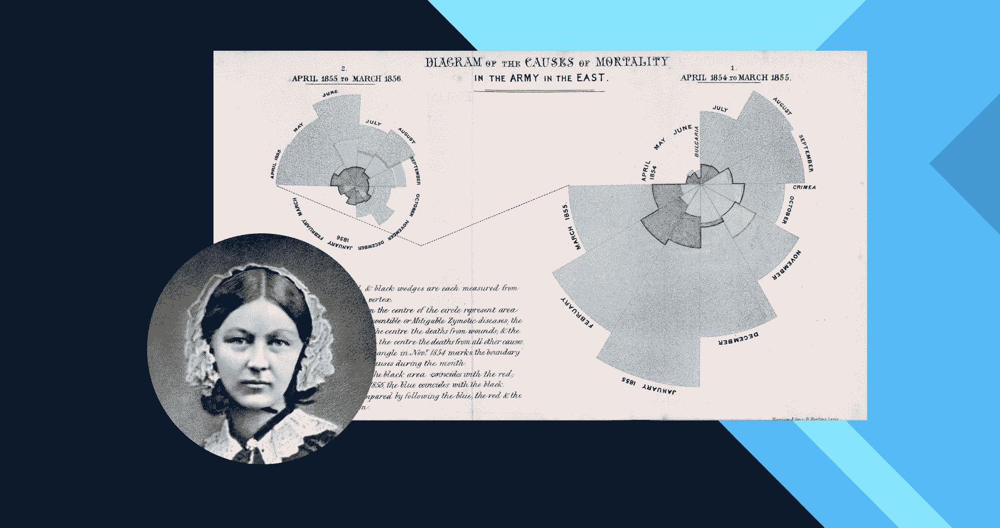
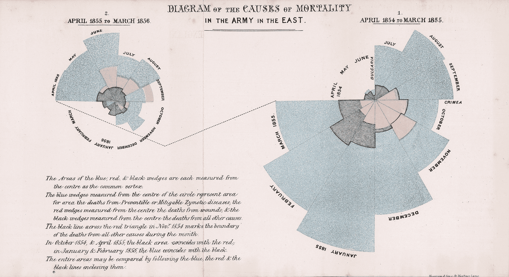

# 佛罗伦萨·南丁格尔:数据可视化的先驱

> 原文：<https://web.archive.org/web/20221129051850/https://www.datacamp.com/blog/florence-nightingale-pioneer-of-data-visualization>

数据可视化经常与商务会议和闪亮的董事会会议室联系在一起，但它的起源非常不同。虽然很难确定数据可视化的唯一发明者或来源，但其先驱之一是一位在英国广受赞誉的现代护理创始人:佛罗伦萨·南丁格尔。

从 21 世纪的角度来看，医院应该干净卫生的想法似乎是理所当然的。然而，在维多利亚时代，由于各种医生和护士的工作，如南丁格尔本人，改革尚未实施，情况正好相反。1854 年 10 月，南丁格尔作为一名军医被派往伊斯坦布尔。在这里的军事医院结束是它自己的一种死刑判决:床有肮脏的床单，经常在不同的居住者之间更换和清洗，到达完整医院的士兵将不得不与住院的老鼠分享同样肮脏的地板。结果，这些医院夺去的生命是战场的 10 倍。所有这些在当时都被认为是正常的:许多有影响力的政治家和官员，包括英格兰的首席医疗官，都认为传染病导致的死亡是不可避免的，不良卫生条件与这些死亡之间没有联系。

南丁格尔确信提高护理质量将减少这些死亡，并以照料士兵而闻名，被称为“拿灯的女士”。她关心他人的天性继续被载入史册，但这个故事中不太为人所知的一面是南丁格尔改进了簿记制度。南丁格尔从小就对统计有着浓厚的兴趣，当她发现医院已经失去了对士兵死亡的记录时，她就指派特定的人做记录。这对她返回英国将是无价之宝。

南丁格尔试图推动广泛的医疗改革，觉得她在土耳其的成就还不够。作为变革故事中的常态，她将不得不面对怀疑者——比如首席医疗官——她自己也知道这一点。

她在战争期间收集的数据和之后制作的图表是她的武器。她理解，公务员和公众的目标受众将更容易理解可视化，而不是数据表:

> “印刷表格和全包双栏，我不认为有人会读。只有科学家才会看报告的附录。这是给庸俗的公众看的。”
> 
> *在南丁格尔的时代，庸俗这个词会被理解为普通的意思。

她最著名的可视化作品是她早期制作的:克里米亚英军死亡人数及其原因的玫瑰图。它通过色彩设计和图案展示了医院死亡人数的减少将会挽救成千上万人的生命。基础数据的收集和可视化过程对南丁格尔也是一个启示:在政府于 1855 年 3 月派出一个卫生委员会清理医院的饮用水和通风设备后，士兵的死亡率大幅下降。在她后来的出版物中，她非常重视改善卫生。

南丁格尔在战争期间已经是一个标志性的人物，他的作品在读者中非常受欢迎，从普通市民到维多利亚女王本人。这是首次使用数据可视化说服决策者进行社会改革的案例之一。由于这些努力，军队医院的卫生状况得到了显著改善。到 19 世纪末，他们的平均死亡率已经下降到[平民医院的一半，而在此之前，平民医院的平均死亡率一直较高](https://web.archive.org/web/20220529044011/https://www.astmh.org/ASTMH/media/Documents/Thomas-Mackie-Presidential-Address.pdf)。南丁格尔将继续利用她的影响力和对数据的热情，在世界各地和各种场合推动医疗改革，从印度的产科病房到美国内战中的医生帐篷。

> 这是数据可视化用于说服决策者进行社会改革的最早实例之一。

在 [Python](https://web.archive.org/web/20220529044011/https://www.datacamp.com/courses/intro-to-python-for-data-science) 、 [R](https://web.archive.org/web/20220529044011/https://www.datacamp.com/courses/free-introduction-to-r) 、 [SQL](https://web.archive.org/web/20220529044011/https://www.datacamp.com/courses/introduction-to-sql) 、 [Tableau](https://web.archive.org/web/20220529044011/https://www.datacamp.com/courses/introduction-to-tableau) 、 [Power BI](https://web.archive.org/web/20220529044011/https://www.datacamp.com/courses/introduction-to-power-bi) 甚至计算机本身存在之前，南丁格尔是一名数据科学家。在今天这个时代，只需要几分钟就可以收集大量的数据并从中构建图表。然而，没有改变的是使用可视化来推动数据素养的基本概念:医疗保健组织直到今天仍然是可视化驱动的，广泛使用 [R](https://web.archive.org/web/20220529044011/https://www.datacamp.com/courses/designing-and-analyzing-clinical-trials-in-r) 和 [Python](https://web.archive.org/web/20220529044011/https://www.datacamp.com/courses/biomedical-image-analysis-in-python) 来改善患者护理和创建更健康的社会。

就像南丁格尔用一种他们容易理解的方式向公众发布她的数据集一样，可视化仍然是数据民主化的一个有价值的工具。

如果您想提高可视化技能来交流数据见解，我们可以提供:

*   可视化软件包上的课程包括: [Matplotlib](https://web.archive.org/web/20220529044011/https://www.datacamp.com/courses/introduction-to-data-visualization-with-matplotlib) 、 [Seaborn](https://web.archive.org/web/20220529044011/https://www.datacamp.com/courses/introduction-to-data-visualization-with-seaborn) 、 [Plotly](https://web.archive.org/web/20220529044011/https://www.datacamp.com/courses/introduction-to-data-visualization-with-plotly-in-python) 、 [ggplot2](https://web.archive.org/web/20220529044011/https://www.datacamp.com/courses/introduction-to-data-visualization-with-ggplot2) 和 [lattice](https://web.archive.org/web/20220529044011/https://www.datacamp.com/courses/data-visualization-with-lattice-in-r) 。
*   可视化工具中的课程，如[电子表格](https://web.archive.org/web/20220529044011/https://www.datacamp.com/courses/data-visualization-in-spreadsheets)、 [Tableau](https://web.archive.org/web/20220529044011/https://www.datacamp.com/courses/introduction-to-tableau) 、 [Power BI](https://web.archive.org/web/20220529044011/https://www.datacamp.com/courses/introduction-to-power-bi) 。
*   现实世界的医疗保健项目，包括 R 的[预期寿命和 R](https://web.archive.org/web/20220529044011/https://www.datacamp.com/projects/166) 的[新冠肺炎病毒传播。](https://web.archive.org/web/20220529044011/https://www.datacamp.com/projects/870)
*   一个[项目](https://web.archive.org/web/20220529044011/https://www.datacamp.com/projects/132)涉及使用 Python 来模拟另一位著名的数据驱动的维多利亚医生:约翰·斯诺博士的工作。

#### 来源:

*   [https://www . science news . org/article/Florence-nightingale-birthday-power-visualizing-science](https://web.archive.org/web/20220529044011/https://www.sciencenews.org/article/florence-nightingale-birthday-power-visualizing-science)
*   [https://medium . com/nightingale/Florence-nightingale-is-a-design-hero-8 BF 6 e5f 2147](https://web.archive.org/web/20220529044011/https://medium.com/nightingale/florence-nightingale-is-a-design-hero-8bf6e5f2147)
*   [https://www . science news . org/article/Florence-nightingale-激情-统计学家](https://web.archive.org/web/20220529044011/https://www.sciencenews.org/article/florence-nightingale-passionate-statistician)
*   [https://www.ncbi.nlm.nih.gov/pmc/articles/PMC2920984/](https://web.archive.org/web/20220529044011/https://www.ncbi.nlm.nih.gov/pmc/articles/PMC2920984/)
*   [https://www . ASTMH . org/ASTMH/media/Documents/Thomas-Mackie-Presidential-address . pdf](https://web.archive.org/web/20220529044011/https://www.astmh.org/ASTMH/media/Documents/Thomas-Mackie-Presidential-Address.pdf)
*   [https://www . Smithsonian mag . com/history/surviving-history-infograph-180959563/](https://web.archive.org/web/20220529044011/https://www.smithsonianmag.com/history/surprising-history-infographic-180959563/)