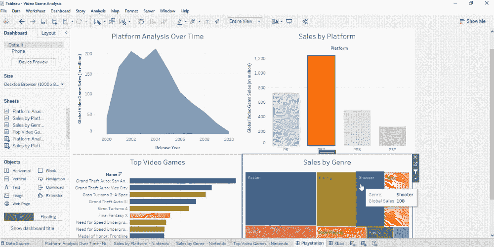

# Tableau 如何帮助您的组织获得更好的数据洞察力

> 原文：<https://web.archive.org/web/20221129051850/https://www.datacamp.com/blog/how-tableau-helps-your-organization-achieve-greater-data-insights>

## 在数字时代保持竞争力

大多数组织已经开始进行数字和数据转型，以便在日益高度互联和数字化的世界中生存和发展。正因为如此，企业现在产生了大量的数据，可以用来做出更好的决策。为了最大限度地提高数据回报，分析师需要获得最佳的商业智能工具，以便为数据驱动的决策提取有价值的见解。

## 什么是商业智能(BI)工具？

商业智能(BI)是一组功能和技术，可将数据转化为可操作的见解，帮助企业做出更明智的数据驱动型决策。商业智能是通过 BI 工具交付的，这些工具为分析师提供了一个简单的拖放界面来执行以下活动:

*   **数据准备:**对来自多个来源的数据进行编译，并对其进行格式化以供分析。

*   **数据查询:**从数据集获取答案，回答特定的数据问题。

*   **数据可视化:**以图表、图形、直方图等形式创建分析的可视化表示，以便于理解。

*   **绩效指标报告:**将当前绩效与历史数据进行比较，并与利益相关方分享结果，以便做出决策。

*   **数据挖掘**:使用统计学和机器学习来揭示大数据集中的趋势。

## 商业智能工具在行业中的使用

BI 的概念从 20 世纪 60 年代就有了。因此，毫不奇怪，市场上已经有几十种成熟的 BI 工具可以帮助组织利用数据进行业务分析。最流行的两个 BI 工具是 Tableau 和微软的 PowerBI。

现代 BI 工具的主要价值在于它们支持自助分析、更快的洞察速度和易于使用的用户界面。现代 BI 工具使员工能够快速访问数据并自己回答业务问题，而不是向中央数据团队发送请求的传统方法。

以下是行业中使用的一些 BI 工具示例:

[沃尔沃集团使用 Qlik](https://web.archive.org/web/20221212135819/https://www.qlik.com/us/resource-library/volvo-groups-journey-to-data-adoption-and-collaboration-with-qlik) 来提高关键财务结果的报告效率，从而在组织内部实现嵌入式自主决策。

[UChicago Medicine 利用 Tableau](https://web.archive.org/web/20221212135819/https://www.tableau.com/solutions/customer/uchicago-medicines-data-driven-response-covid-19) 创建实时仪表盘，作为医疗中心对新冠肺炎疫情的数据驱动运营响应的一部分

[苏黎世保险集团借助 Power BI](https://web.archive.org/web/20221212135819/https://customers.microsoft.com/en-us/story/854431-zurich-insurance-azure-power-bi) 构建一个统一的平台，帮助企业用户更有效地挖掘和利用公司数据。

[摩根大通采用 Tableau](https://web.archive.org/web/20221212135819/https://www.tableau.com/solutions/customer/jpmorgan-chase-chooses-tableau-enable-self-service-analytics-keeping-rapid) 从 IT 拥有的自助服务分析转变为业务拥有的自助服务分析，以跟上快速的行业变化并优化业务成功的流程。

## 什么是 Tableau？

Tableau 是一个 BI 和数据可视化工具，它利用可视化分析来帮助个人和组织充分利用他们的数据。Tableau 中创建的引人入胜的可视化帮助利益相关者理解大量可用的数据。

Tableau 始于 2003 年斯坦福大学的一个项目，旨在通过可视化让人们更容易获取数据。它现在是现代 BI 的市场领先选择，被所有行业的组织所使用。

在市场上的商业智能工具中，Tableau 可能是最受欢迎的。Enlyft 报告称，Tableau 在 BI 类别的技术中拥有最大的市场份额(16.3%)。

*Survey on the market share of BI tools | Source: [Enlyft](https://web.archive.org/web/20221212135819/https://enlyft.com/tech/products/tableau)*

## Tableau 怎么用？

### 1.提取数据洞察，无需编码技能

Tableau 的主要优势之一是其直观的用户界面，允许技术和非技术分析师高效地构建数据可视化和分析。

用户友好的拖放界面使回答复杂的数据相关问题变得容易，而不需要编程技能。这种简单性降低了用户执行高级分析(如趋势分析、回归和统计汇总)的障碍。

Tableau 还为分析师提供了一套认证，以验证和证明他们在产品知识和数据可视化技能方面的专业知识。这有助于帮助分析师成为有效的数据从业者，因为这些认证与任何行业或角色的任何地方都高度相关。

### 2.借助仪表盘实现数据洞察的民主化

大多数人都熟悉的一个经典 BI 应用程序是**仪表板**，其中数据从多个来源获得，并以图表和图形的形式直观地呈现，以提供公司流程和战略的感觉。

Tableau 附带了许多工作簿功能，用户可以轻松创建设计良好的交互式仪表板。它还可以连接到各种数据源(例如 SQL Server、Excel 电子表格、Amazon Redshift 等)。).因此，这些仪表板可以用来自组织内各种应用程序的综合数据来丰富。

这些仪表板在协调组织的战略努力、揭示关键见解和加速企业范围的决策方面大有帮助。当许多用户接受创建这种仪表板的培训时，数据洞察可以大规模民主化，以帮助企业转型为数据驱动的公司。

*Example of a sales dashboard built with Tableau | Source: [DataCamp's Tableau Fundamentals Track](https://web.archive.org/web/20221212135819/https://www.datacamp.com/tracks/tableau-fundamentals)*

### 3.借助高级数据可视化讲述数据故事

鉴于数字时代产生的大量数据，引人注目的数据故事比以往任何时候都更加重要。

仪表板非常适合监控数据，并告诉用户*正在发生什么。然而，**数据故事**有助于将数据塑造成一个循序渐进的过程，以解释 ***为什么*** 特定趋势正在发生。*

 *Tableau 允许用户将一系列可视化效果(包括仪表板)串连起来，形成一个可视化的故事，以交流数据见解，提供背景，并演示决策与结果之间的关系。将高级可视化(例如地理空间映射)编织成连贯的数据叙述的能力是 Tableau 区别于 Excel 等其他工具的地方。这些数据故事在构建令人信服的案例以向决策者传达可操作的见解方面非常有效，这与商业智能的主要目标相一致。

*Example of a Tableau data story created to answer questions relating to bike-sharing data | Source: [Creating Dashboards in Tableau](https://web.archive.org/web/20221212135819/https://www.datacamp.com/courses/creating-dashboards-in-tableau)*

## 通过 Tableau 和 DataCamp 实现数据科学的民主化

NewVantage Partners 的 [2021 年大数据和人工智能执行摘要](https://web.archive.org/web/20221212135819/https://www.newvantage.com/thoughtleadership)显示，只有 24%的公司被认为是数据驱动的。为了释放数据的价值，员工需要用工具武装自己，以便有效地从数据中学习。

Tableau 是一个广泛使用的商业智能和分析软件，受到亚马逊、益百利和联合利华等公司的信任。凭借其用户友好的拖放功能，Tableau 使组织中的每个人都能够探索、分析、共享和可视化业务数据，并使所有人的见解民主化。

[DataCamp 的 Tableau 基础技能课程](https://web.archive.org/web/20221212135819/https://www.datacamp.com/tracks/tableau-fundamentals)将帮助您的团队掌握大规模数据民主化的技能，并通过 Tableau 的桌面专家认证。

*