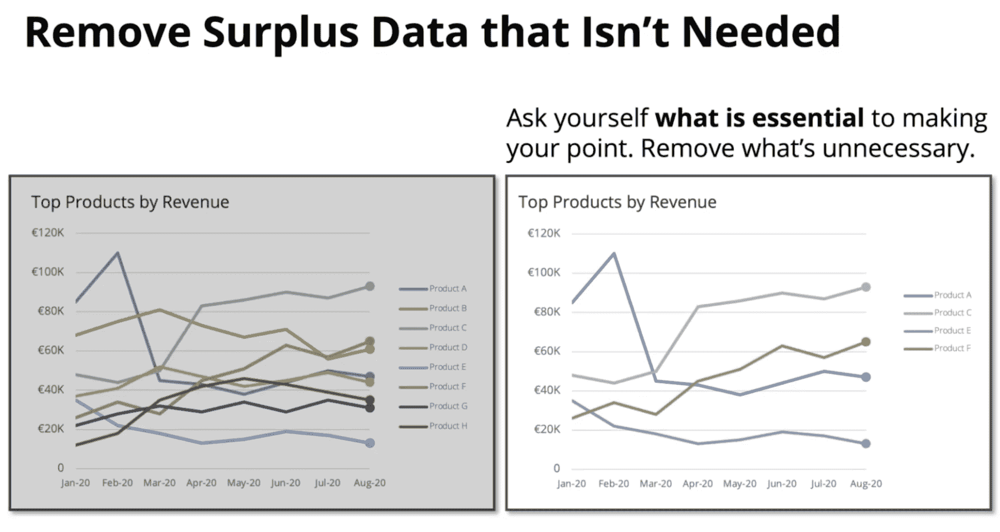
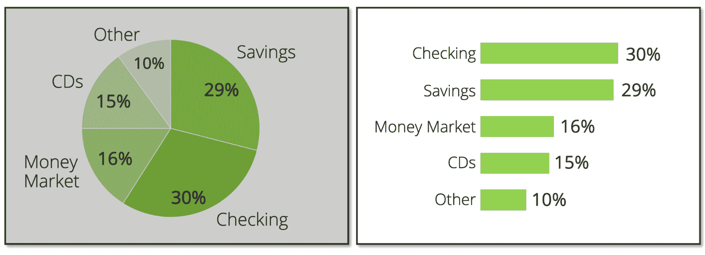
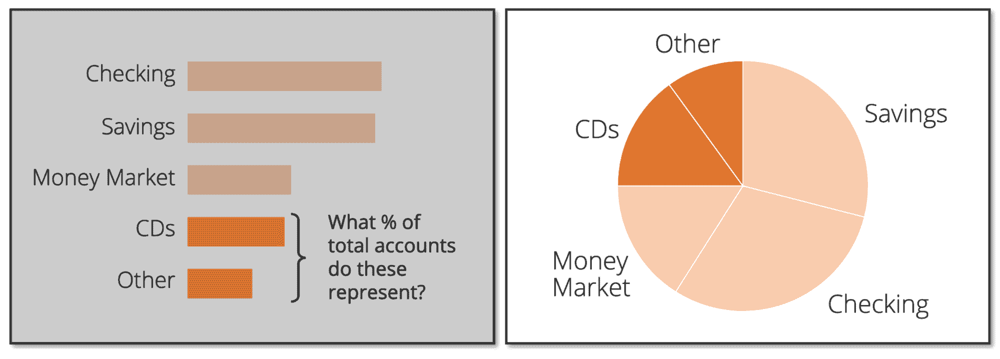
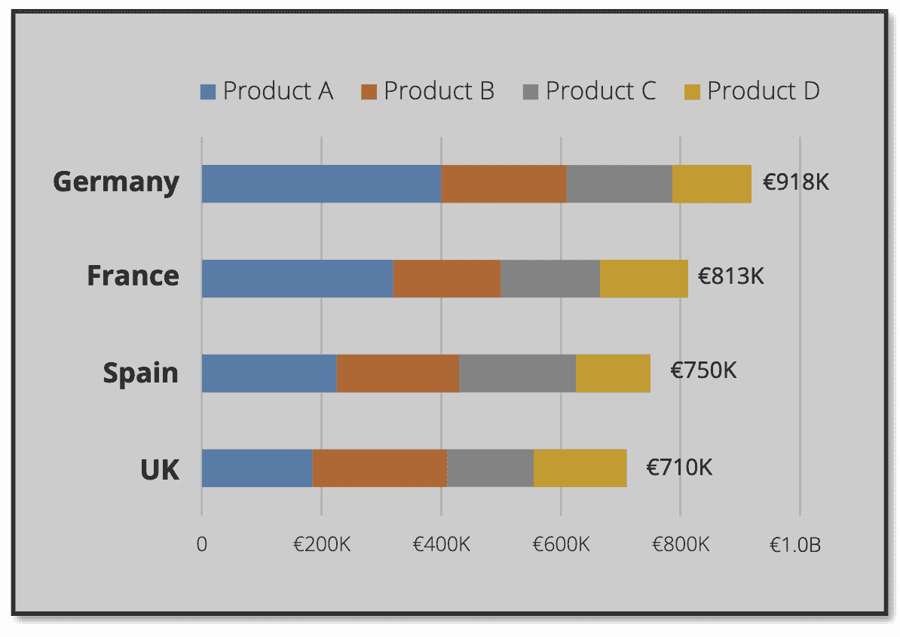
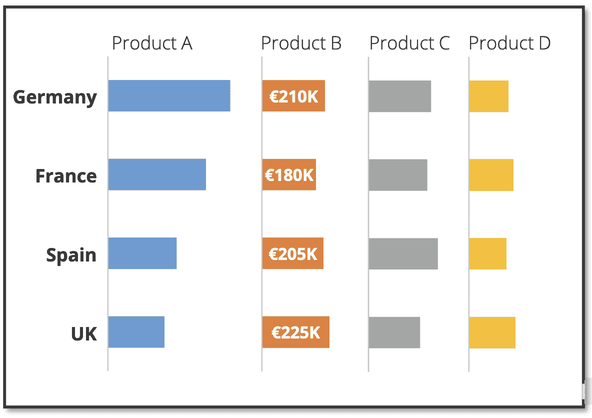
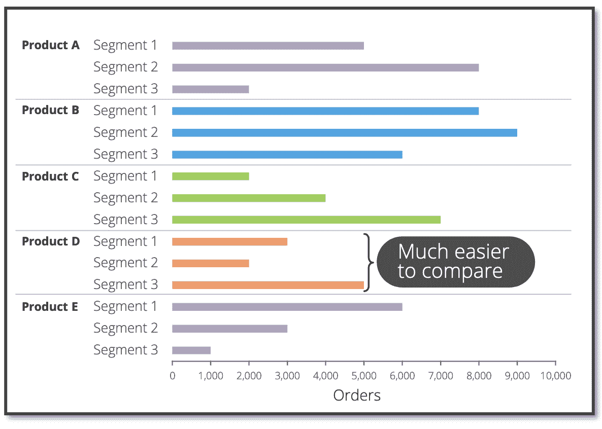
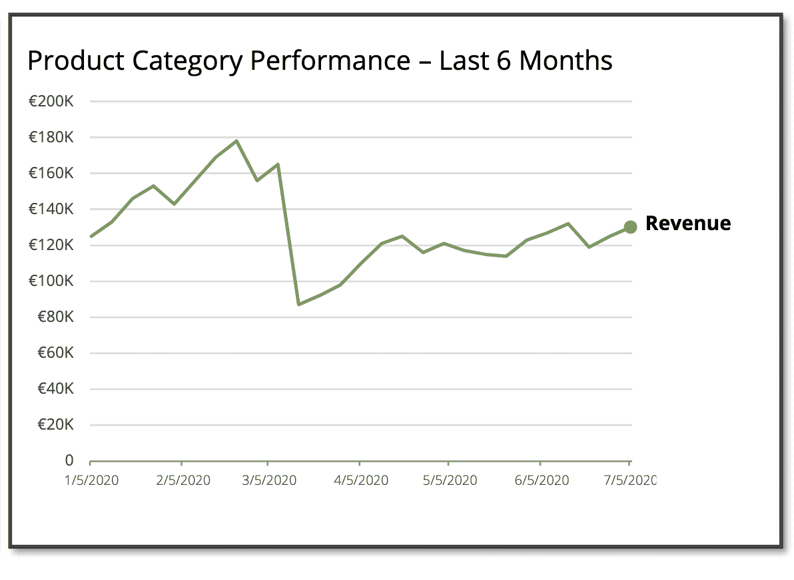
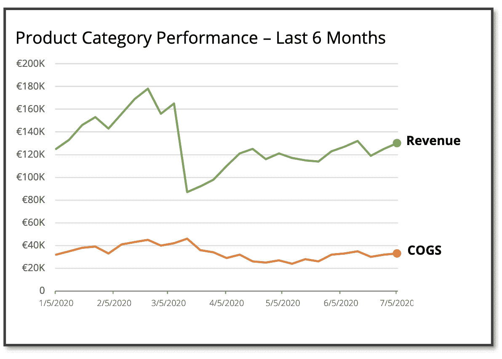
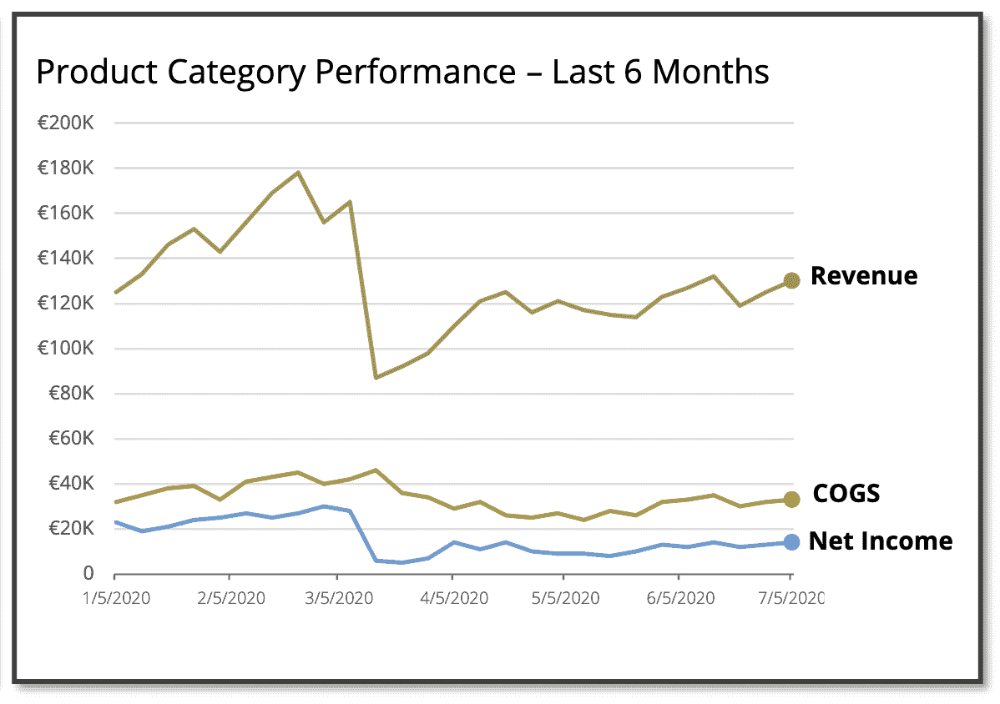

# 用数据、叙述和视觉效果讲述有效的数据故事

> 原文：<https://web.archive.org/web/20221129045128/https://www.datacamp.com/blog/telling-effective-data-stories-with-data-narrative-and-visuals>

“讲故事是将想法融入当今世界的最有力的方式，”编剧大师罗伯特·麦基说。今天的企业世界充斥着设计糟糕的幻灯片和不合适的图表，而[数据讲述](https://web.archive.org/web/20221020001916/https://www.datacamp.com/data-courses/data-visualization-courses)是将数据转化为推动行动和价值的见解的关键。

事实证明，数据故事比单纯的统计数据更令人难忘、更有说服力、更吸引人。但是我们如何讲述数据故事呢？《有效的数据叙事:如何用数据、叙事和视觉推动变革》一书的作者布伦特·戴克斯为构建数据故事制定了一个[有价值的框架](https://web.archive.org/web/20221020001916/https://www.datacamp.com/resources/webinars/effective-data-storytelling-brent-dykes-1)。

在这个框架中，数据故事由三部分组成——叙述、数据和视觉。在本帖中，我们将深入探讨数据故事的每一个组成部分。

Figure 1: Narrative, visuals and data are data stories that drive changes

## 叙事结构

大多数故事都遵循一个共同的轨迹——一个面临复杂情况的主角在回到正常生活之前开始了解决困难的旅程。亚里士多德的悲剧结构，坎贝尔的英雄之旅，弗莱塔格的金字塔是这些故事中常见模式的变体。

数据故事受益于古老的叙事结构。数据故事从设置当前情况的场景开始，通过提供导致核心见解的见解继续，并以相关建议结束。

Figure 2\. The narrative structure of a data story

## 数据

面对海量数据的分析师可能会试图将所有可用的数据都压缩到一个图表中。那些这样做的人冒着用噪音混淆他们的数据故事和迷惑他们的观众的风险。

这就是为什么在数据故事中选择正确的数据至关重要。Brent Dykes 建议数据说书人删除或汇总次要数据点，如下例所示。

Figure 3\. Explicitly demonstrating that the revenue per customer is falling (right) is a better choice than plotting the total revenue and customer side-by-side (left)

Figure 4\. The market shares of the largest markets become apparent when the smallest markets are aggregated.

Figure 5\. Often, less is more when it comes to showing multiple charts in one graph.

## 视觉的

有了正确的结构和数据，我们就可以用视觉来讲述数据故事了。在这里，Brent 提供了为数据故事制作完美视觉效果的有用技巧。

#### 1.选择合适的可视化

基于数据故事的上下文，可视化的有效性有所不同。关键是根据信息选择最佳图表。

例如，在传达比例差异方面，条形图优于饼图(图 6A 与图 6B)。另一方面，当显示不同类别的比例总和时，饼图是更好的选择(图 7A 与图 7B)。

Figure 6A and 6B

Figure 7A and Figure 7B

#### 2.根据信息调整视觉效果

一个合适的数据故事安排视觉效果，以满足观众的需求。为了证明这一点，戴克斯比较了两个图表，这两个图表传达了针对略微不同的目标优化的相同数据。

比较图 7A 和 7B，我们观察到水平轴的对齐如何使观众更容易进行快速比较。

Figure 8A. A comparison of the total revenue from each country

Figure 8B. A comparison of the revenue of individual products across countries, especially for product B

另一方面，根据可视化的目标，图 9A 和 9B 被稍微不同地重新排列。

Figure 9A. A comparison across products for each segment

Figure 9B. A comparison across segments for each product

#### 3.集中观众的注意力

观众关注的是图表中突出的部分。突出关键点从噪音中提取信号，让观众快速从图表中获得洞察力。

例如，节约使用颜色(图 10B)和文本(图 10C)可以极大地改善混乱的图表(图 10A)。

Figure 10A

Figure 10B

Figure 10C

另一个吸引观众注意力的技巧是使用动画分阶段展示洞察力。在下面的例子中(图 11)，观众能够想象新冠肺炎开始时利润显著下降的影响。

Fig 11: Revealing insights in stages

## 结论

布伦特写道:“许多大胆、不可思议的见解如果不能成功地融入数据故事，也会遭受类似的命运。”因此，随着公司积累更多的数据，讲述数据的技能将变得越来越重要。

无论您是数据故事讲述的新手还是老手，Brent 举办的网络研讨会“[有效的数据故事讲述:如何将见解转化为行动](https://web.archive.org/web/20221020001916/https://www.datacamp.com/resources/webinars/effective-data-storytelling-brent-dykes)”为所有级别的数据故事讲述者提供了宝贵的框架和实用技巧。

